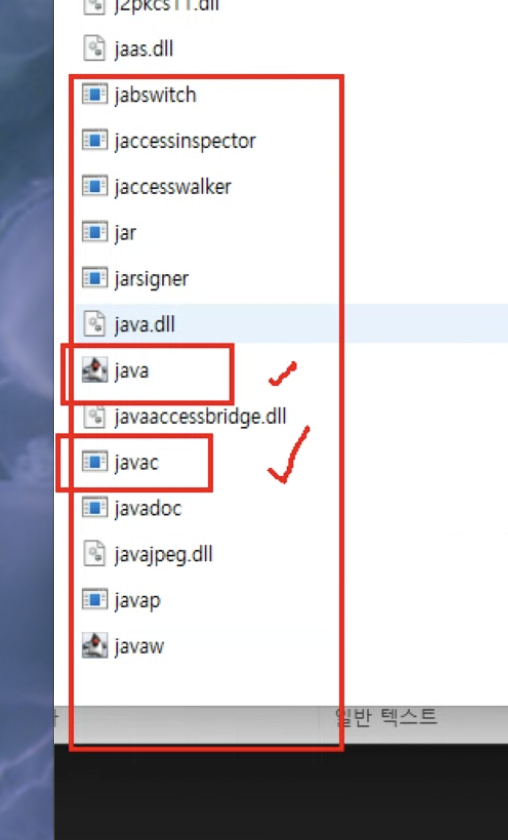
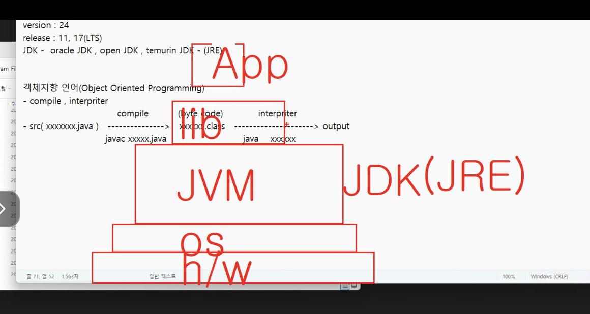
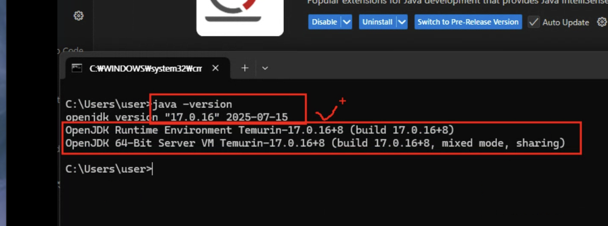
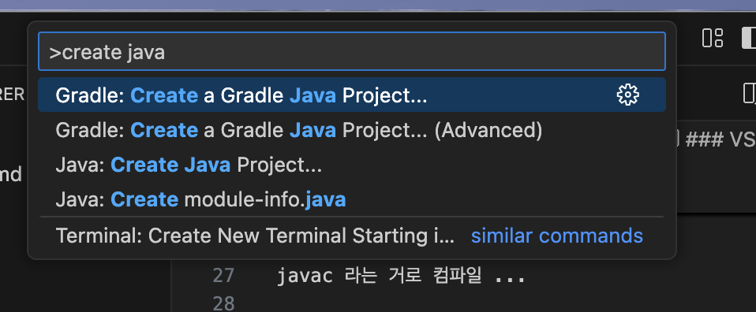
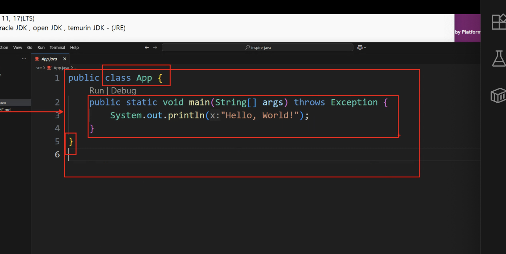
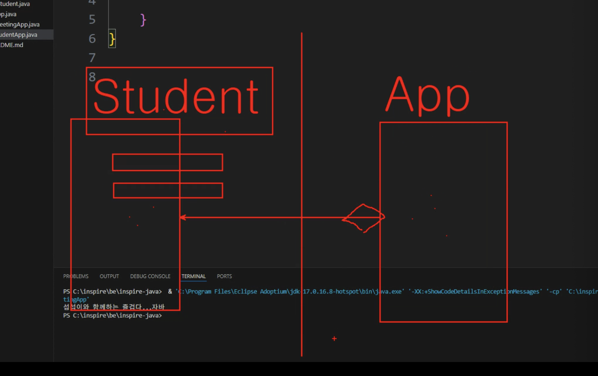
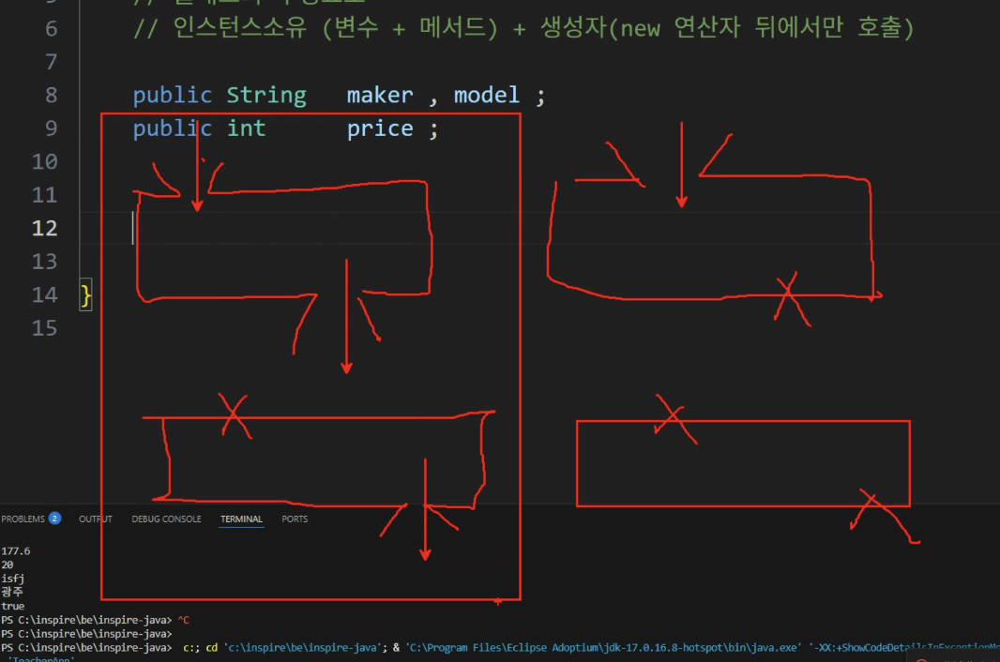

# BACKEND(BE) - JAVA(eclipse)

0807

# JDK

- oracle JDK (oracle 주최)
- open JDK (oracle 주최 open sorce)

- temurin JDK

version :24
release : 11, `17(LTS)`
현업에서는 더 낮은 버전을 주로 사용한다......

JDK 플랫폼 (se, me, `ee`)

## JAVA

객체지향언어

> 은닉화(정보은닉X, 객체 타입을 숨기는 것), 상속, 다형성, 추상화

- compile , interpriter 방식 지향
- jvm 의존성을 가지며, os 의존성을 가지지 않는다.



- src(xxxxxx.java) ------(compile(javac))-----> xxxxxx.class

javac 라는 거로 컴파일 ...

- xxxxxx.class ------(interpriter(java xxxxxx))------> output

.class 파일이 중요함 !(자바의 실행파일.. byte code..)

JDK 설치하면 그 안에 JRE 라는게 있음

JRE : java의 실행환경

os : 하드웨어 제어...해줌...
JDK 안에 JVM(자바 가상 환경???) 이라는게 설치되어있음





### VSCODE 명령어 팔레트 : CTRL + SHIFT + P



Gradle : 배포까지 할...

# 시작



### 실행 : `fn + F5`

## 클래스란 ?

Instance를 만들어주는 틀..
(클래스는 Instance가 아님)

- 클래스의 구성요소인 변수와 메서드는 클래스의 소유가 아닌 인스턴스의 소유다.

```
[Real World]
   ↓
[Object] → 추상화 → [Class]
                    ↓
          ┌──────────────┐
          │ Variable     │ ← 상태/데이터
          │ Method       │ ← 기능/동작
          └──────────────┘
                    ↓
              [Instance]
                    ↓
               실행: App(JVM)
```

### 3계층 아키텍처 (Three-tier Architecture)

- Presentation Layer (프레젠테이션 계층) : 사용자 인터페이스(UI)와 상호작용
- Business Layer (비즈니스 계층) : 비즈니스 로직 수행
- Consistency Laye : DB 저장 및 데이터 일관성 관리

### RDBMS

**Relational DataBase Management System(관계형 데이터베이스 관리 시스템)**

## 변수 선언 문법

접근지정자(public, private) 타입 변수명 ;

public int age;

## 변수의 타입(자료형)

- 기본타입 : 값을 담는 그릇

  - 숫자
    - 정수 : byte(1 -> 8). short(2). int(4). long(8 -> 64)
    - 실수 : float, double
  - 문자 : char
  - 문자열 : String ----------------> `대문자 시작 : 클래스임`.
  - 논리 : boolean(true|false)

- 참조타입: 생성된 인스턴스의 주소값을 담는 그릇
  - 기본타입이 아닌 모든 변수타입

## 메서드 (method) : 행위

##



### JVM(heap)

> 객체가 저장되는 메모리 공간 (GC 대상)

### inversion of control : IOC 제어의 역행

> 객체 생성/관리를 개발자 대신 프레임워크가 제어

##



매개변수 o
반환 o

매개변수 x
반환 o

가장 많이 사용

## 현장에서 만들게 되는 파일들...

```
xxxxxController.java

xxxxxService.java
xxxxxServiceImpl.java

xxxxxRepository.java


xxxxxVO.java ---------|
xxxxxDTO.java         |---->
xxxxxEntity.java------|

```

```
[Controller]
   ↓ 요청
[Service Interface] ←→ [ServiceImpl]
   ↓ 비즈니스 로직
[Repository] ←→ [Entity (DB)]
   ↑
DTO / VO: Controller와 Service 사이에서 주고받는 데이터 포맷

```
