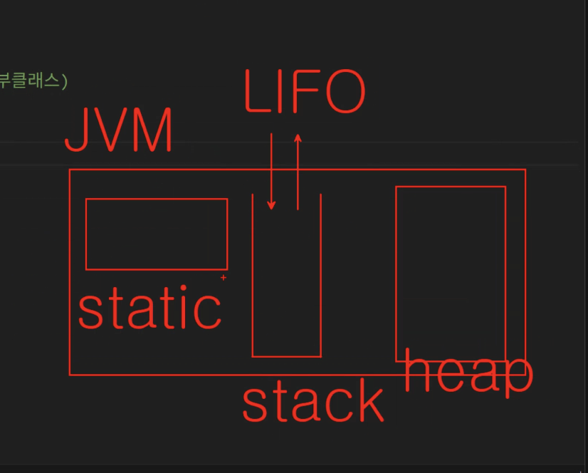
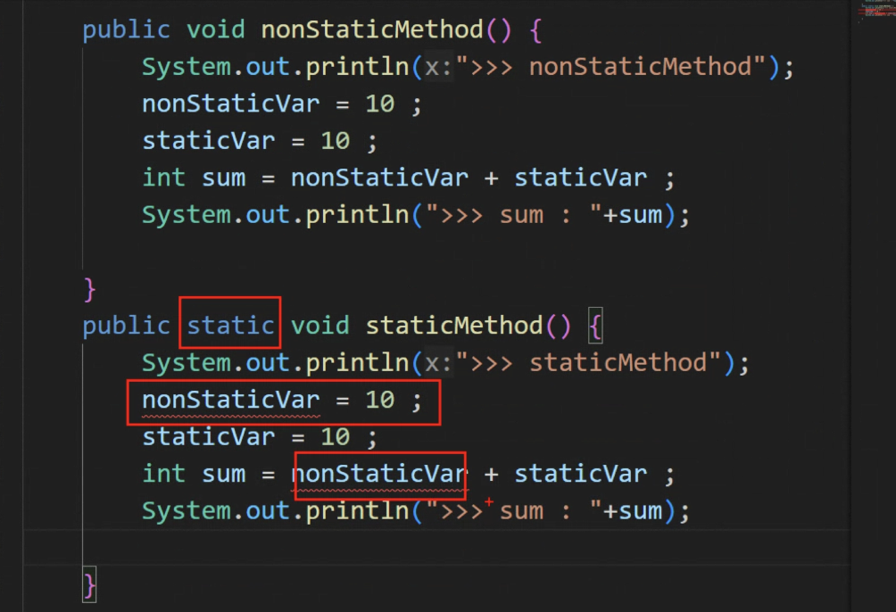
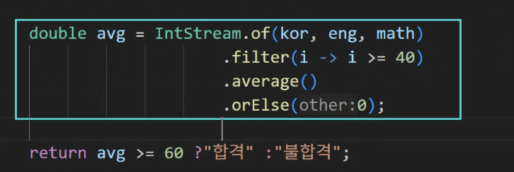
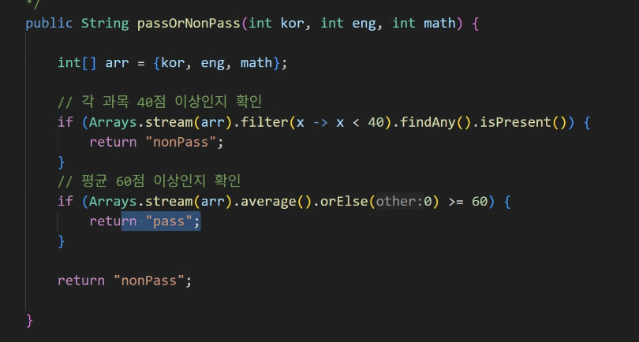
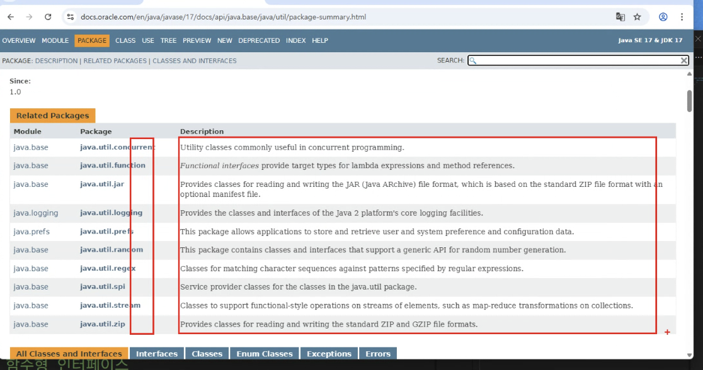
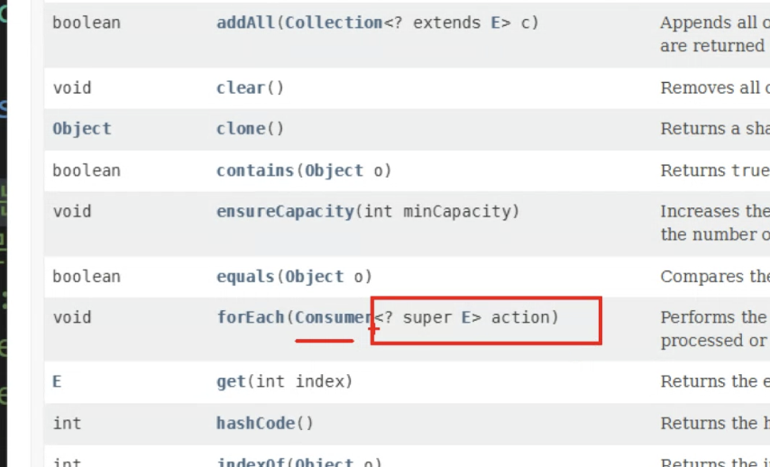
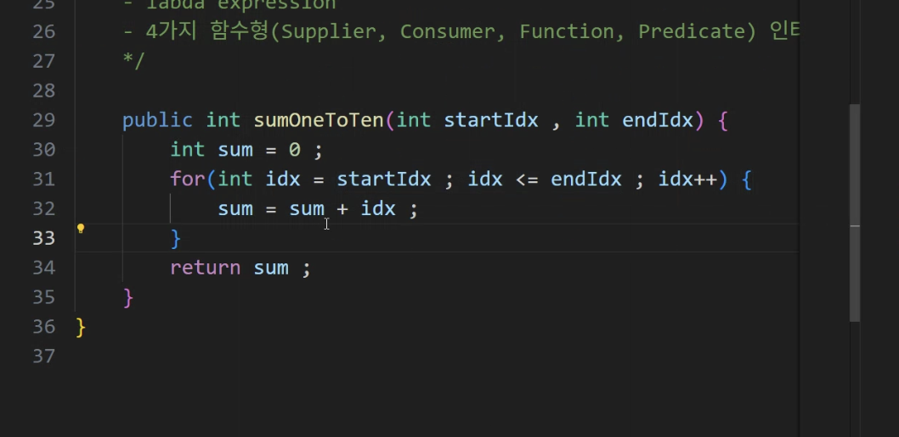
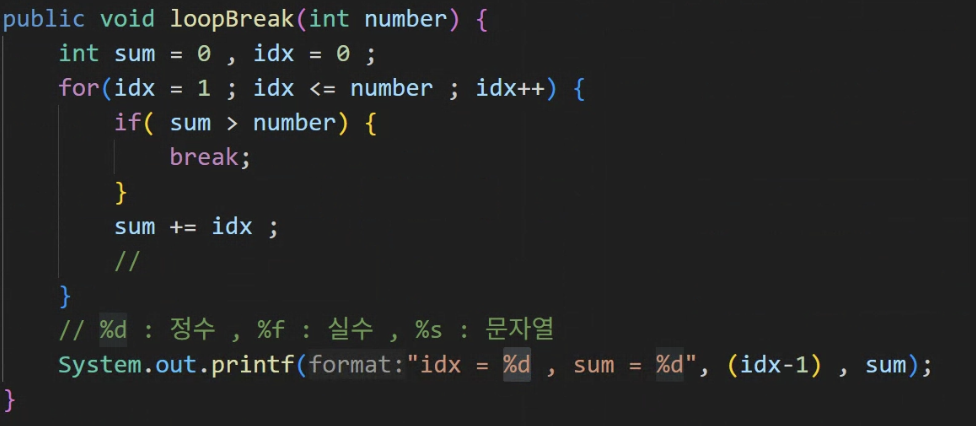
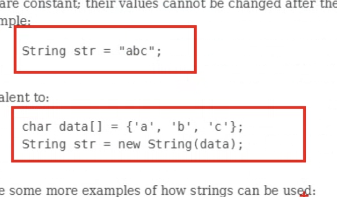

# DAY 13 (0808)

### Spring MVC - Framework 구조 특징

- 여러 계층(Controller, Service, Repository 등)으로 나뉘어 각자 역할을 수행
- 각 계층의 클래스들은 서로 의존 관계를 가질 수밖에 없음

- 설계 목표:

  - 응집도(Cohesion) ↑ : 각 클래스가 자신의 책임과 기능에 집중
  - 결합도(Coupling) ↓ : 클래스 간 의존성을 최소화해 변경에 유연하게 대응

---

### static



heap : 생성된 instance들이 올라는 곳



클래스 소유는 인스턴스 소유에 접근 불가

- static : 클래스 소유

- nonstatic : 인스턴스 소유 ------> 인스턴스 생성시에 가능

```
  // staticMethod는 클래스 이름으로 직접 호출 가능
  StaticDemo.staticMethod(); // static 메서드 호출
```

---



IntStream..

처리속도의 성능 향상을 위해 사용 ?



stream

---

데이터 가공?

---

https://docs.oracle.com/en/java/javase/17/docs/api/index.html







java.lang

Math Class !!

-----> 기본 패키지 : import 없이 사용 가능





우리가 사용하는 string은 char의 배열과 같음...!!
