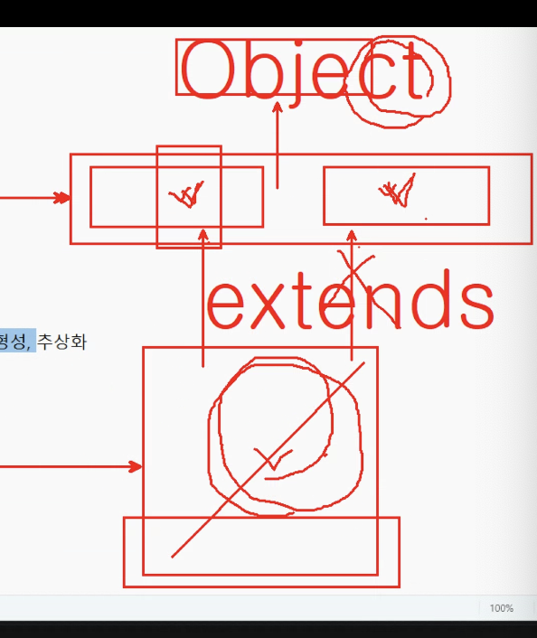
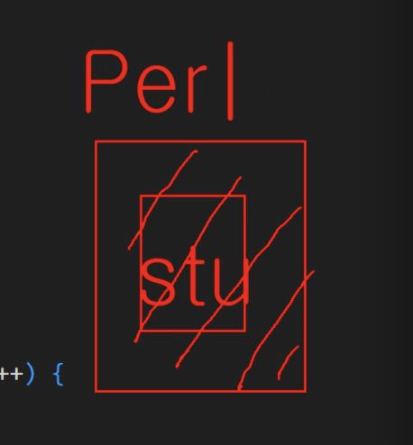
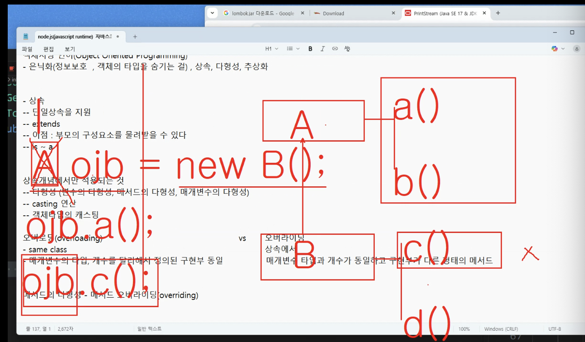

# DAY 15 (0811) - BE

## OOP(객체지향 프로그래밍)의 주요 특징

> 은닉화(정보보호,, 객체의 타입을 숨기는 것..), 상속, 다형성, 추상화

1. 은닉화(Encapsulation)

   - 객체 내부의 속성과 동작을 외부로부터 숨기고, 필요한 인터페이스만 제공

   - 정보 보호 & 구현부 변경 최소화

2. 상속(Inheritance)

   - 부모 클래스(슈퍼 클래스)의 속성과 메서드를 자식 클래스(서브 클래스)가 물려받아 재사용

   - 자바는 단일 상속만 지원

   - 최상위 부모 클래스는 Object

3. 다형성(Polymorphism)

   - 같은 타입의 참조 변수로 다양한 객체를 다루는 능력

   - 변수의 다형성, 메서드의 다형성(오버로딩·오버라이딩), 매개변수의 다형성

4. 추상화(Abstraction)

   - 공통 속성과 동작을 추출하여 모델링

   - 구체적인 구현보다 개념적 설계 중심

---

- super class, sub class

확장.. extends..

- 부모가 가진 요소를 자식에서 그대로 사용가능 !

자바는 단일상속만 !

최상위? Object

## 상속

- 단일상속 지원
- extends
- 이점 : 부모의 구성요소를 물려받을 수 있다.
- is ~ a

상속개념에서만 적용되는 것

- 다형성 (변수의 다형성, 메서드의 다형성, 매개변수의 다형성)
- casting 연산
- 객체타입의 casting..

베열의 타입이 person이기 때문에 나는 stu인데 per라는 포장지로 둘러쌓인 느낌...
업캐스팅...!!

-> 포장지를 찢는느낌이 다운캐스팅 !

---

### 오버로딩(overloading) vs 오버라이딩

> 오버로딩 :

- 같은 클래스
- 매개변수의 타입, 개수를 다르게 정의된.. 구현부 동일

> 오버라이딩 :

- `상속`에서만 !!
- 매개변수 타입과 개수가 동일하고 구현부가 다른형태의 메서드

-> ojb.a() : 문제 없음
-> ojb.c() : 안됨 !! ------> 캐스팅 해주면 가능

---

### 메서드의 다형성 : 메서드 오버라이딩

### Buffered Reader??

### Final은 상속이 안됨 !
