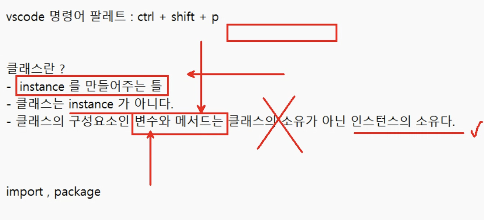
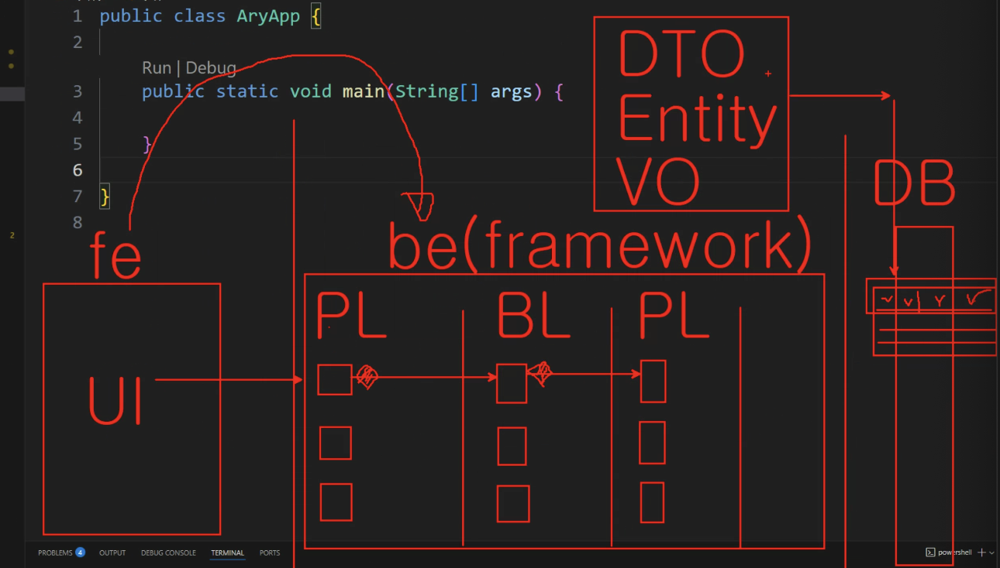
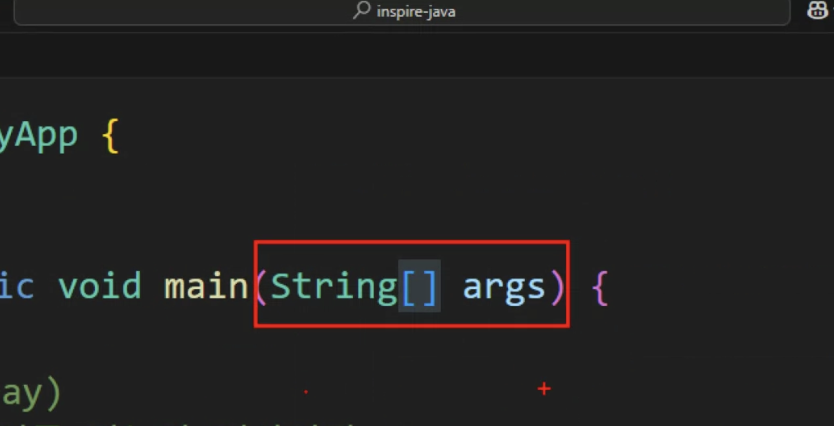
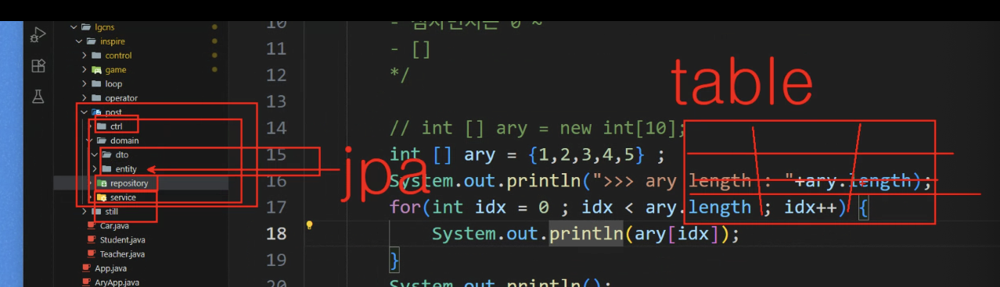
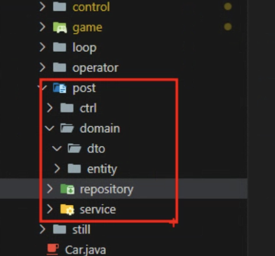
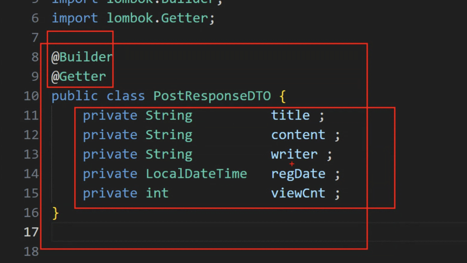
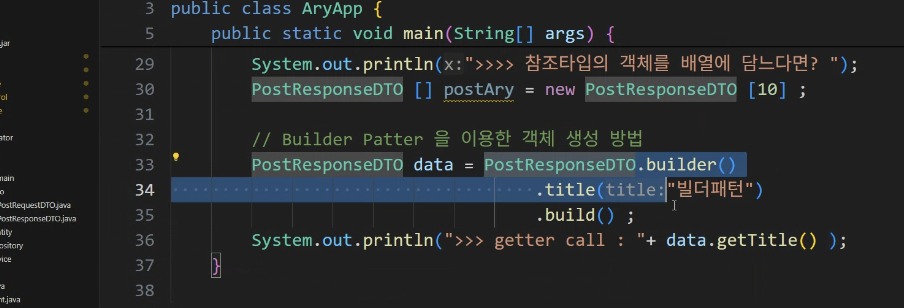

DTO Entity VO

---

DTO : 데이터를 가지고 각각의 레이어를 이동하는 것들을 DTO..

Value Object : VO
-> Req, Res 역할 안나누고 하고싶다? 할때 VO 사용

java.util.Map - HashMap
: DTO, VO를 사용 안할 경우 ? Map에 담는식으로도 사용함

개발자들 성향에따라 많이 다른듯

annotation : 코드로 객체를 생성하고 메서드에 접근하는...
ex. lombok.jar , JSR-310표준

현장에서 이렇게 쓰기도 함
