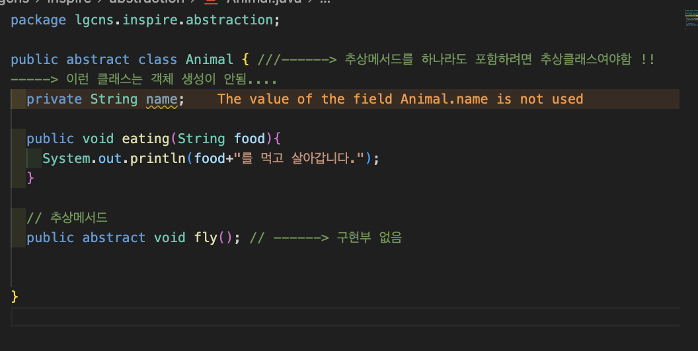

# DAY 16 (0812) - BE

## 추상화 (abstraction)

MVC
Model
View
Controller

WAS(Web Application Server)
:
웹로직 웹스피어 제이보스..

layer3개를 이렇게..

```
controller ---- Model ----
                  |
                  |-
                  |-
                  |-
```

- 인터페이스

  - 객체 생성 불가
  - 추상메서드(구현부를 가지지 않는 메서드)와 상수
  - implement....

- 추상클래스(Abstraction Class)

  - 일반클래스와 동일한데 추상메서드를 하나라도 포함한다면 추상클래스
  - 객체생성불가
  - extends
  - abstract 키워드

xxxService.java ------> interface
xxxServiceImpl.java ------> class

인터페이스나 추상클래스를 상속받는 서브클래스는 반드시 모든 추상메서드를 오버라이딩해야한다.

```
            추상메서드..
  Animal ----> fly();      Vehicle
    |                         |
 |-------------|              |
Bird,      SuperMan,      Airplane
   |           |
    ->fly(){}   ->fly(){}

```

-> 이런 설계는 tiger를 만들면 fly가 들어가게 됨...(별로)

```
Bird, SuperMan ---- Animal 상속
               |____ Flyer implement

```




-> 추상클래스는 객체생성 불가 !

## 은닉화 (Encapsulation)

```
private String name; -------> 이게 은닉화가 아님 !!! 단순한 info hiding
```

- 객체의 타입을 숨길 수 있어야 함

```
          interface
            <-----
client ---------------- servant
            ----->


```

---

결합도가 낮은 설계를 하게 되면 코드 수정을 최소화할 수 있음

lose cuppling 지향 ~

---

## Pattern(Singleton)

: 객체의 인스턴스를 하나로 유지 !

무분별한 객체 생성 X -------->


### Pattern(Factory) 같이 사용

:인스턴스 생성하는 공장

client가 직접적으로 관계를 갖는 것도 지향함

-> Factory에 요정 -----> Factory를 Singleton으로 만들면 -----> TV만 전달


---


```
    BeanFactory factory01 = BeanFactory.getInstance();
    BeanFactory factory02 = BeanFactory.getInstance();

    System.out.println(factory01);
    System.out.println(factory02);

    >>> lgcns.inspire.factory.BeanFactory@14dad5dc -----> 주소가 동일
    >>> lgcns.inspire.factory.BeanFactory@14dad5dc
```

> 주소가 동일 --------> 인스턴스 하나로 유지.......

프레임워크는 기본적으로 인스턴스를 하나로 사용......
-> 무분별한 객체생성으로 메모리관리 못한다? -> 하나로 막혀있음 !

---


문자열비교에는 equals 사용하는게 좋음

> equals는 주소의 값을 비교
>
> ==는 주소값을 비교하는 것
>
> ==는 기본타입과 참조타입을 사용했을 때에 다른 결과를 가져옴

literal Pool


---

## 상수

```
public static final int STU = 1; // -------> 문제점 존재 -----> enum 사용

```

### enum : 상수의 집합

- `타입의 안정성과 가독성`을 높일 수 있음
- 컴파일 시점에 잘못된 값 입력을 방지


service : 보통 interface
serviceImpl : service implements 하는 class
