# DAY 17 (0813) - BE

## DBMS

```
`Front` ------> `Back` ------> `DBMS`
      <--------(data)---------
```

### MVC

백엔드는 레이어드 아키텍쳐 개발방식 사용

각 레이어에서 만들어지는 클래스 -----> 다르 클래스와 관계생성

클래스를 만드는 이유? 인스턴서 생성목적
클래스 변수나 메서드? 인스턴스꺼

맨 뒷쪽 영역 : persitence layer : 영속성 관리
--> SQL 이용해서 DBMS에서 가져온 데이터 관리

Buisness logic

배열의 길이가 리사이징되고, 다양한 타입을 담을 수 있음 좋겠다.
다양한 타입 담기?-> 상속관계여야함.

---

## Collection API

- List() ------> 중복허용, 순서존재, 객체를 요소로 갖는다, 가변길이
- Set ------> 중복X, 순서X, 객체를 요소로 갖는다, 가변길이

- Map({key : value})

---

java.lang

`Java.util`

java.util.function

java.util.stream

인터페이스...

### Interface Collection ..

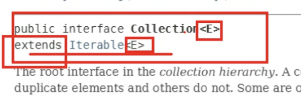

extends : class --> class 상속 , interface -> interface도 이럼

implements : interface --> class 상속

### Class ArrayList<E>

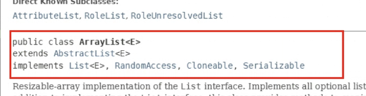

---

스레드는 프로세스 내에서 동작하고 프로세스는 독립 메모리 가집니다

---

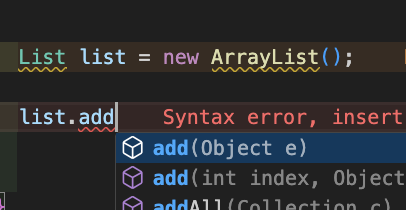
--> 매게변수의 다형성.

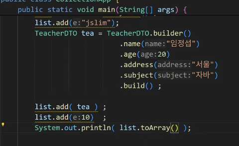
--> 객체 담을 수 있다 !

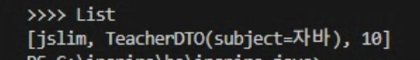

---

### Wrapper Class (Boxing, UnBoxing)

- int -> Integer

- char -> Character

- ...

-> 기본 데이터타입 전부 존재 !!

---

### Generic 문법 <E>

- 불필요한 타입의 캐스팅과..
- 타입의 안정성 확보함

```
 List<String> list2 = new ArrayList<String>();
 List<Integer> list3 = new ArrayList<Integer>();

 ----> WrapperClass 사용 !!!
```

```
package lgcns.inspire.generic;

public class ErrorCode<T> { // 어떤 타입이 드러올지 모르지만 변수의 타입으로 사용하겠다 ~
  private T code; // T 타입 → 객체 생성 시 지정됨
  public void setCode(T code){
    this.code=code;
  }
  public T getCode(){
    return code;
  }
}

```

---

## Set

### HashSet

`Set<String> set = new HashSet<>();`

- 순서 X : add하는 순서와 다름
- 중복 X : 한번만 출력됨

---

## Map -> collection 아님!

### HashMap

### Map({key : value})

- value로 List(객체)를 담는 경우가 많음 : 활용도 높음

```
  // 예시
  Map<String, List<PersonDTO>> map = new HashMap<>(); // key, value-> PersonDTO

  List<StudentDTO> stuList = new ArrayList<>();
  List<TeacherDTO> teaList = new ArrayList<>();
  stuList.add(stu);
  teaList.add(tea);

  map.put("STU", stuList); //----> type에러 !!! PersonDTO아닌 StudentDTO, TeacherDTO
  map.put("TEA", teaList); //---->

```

`Map<String, List<PersonDTO>> map = new HashMap<>();`

---- 수정 ---->

`Map<String, List<? extends PersonDTO>> map = new HashMap<>();`

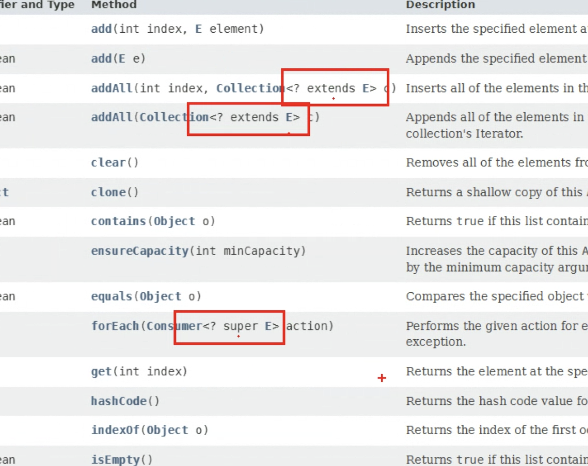

---

## 예외처리

1. 컴파일시점 예외 \_ IOException
2. 런타임시점 예외 \_ RuntimeException

```
  try{
    예외발생 코드
  } catch( 발생 예외 객체 정의 ){
    예외발생시 수행되는 블럭
  } finally{
    예외발생여부와 상관없이 무조건 수행 블럭
  }
```

- try ----> catch,finally 중 적어도 하나랑 쌍을 이뤄야함.

- finally ----> 필수 x 선택o

### 함수형 인터페이스(value + variance) : 베이버

```
Try.of(예외발생 가능 코드)
   .onFailure() //-------> 예외시 처리
   .getOrElse() //-------> 실패시 특정 값을 반환
```

---

## Scanner에서의 런타임에러

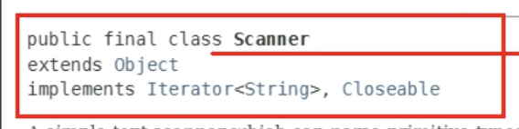

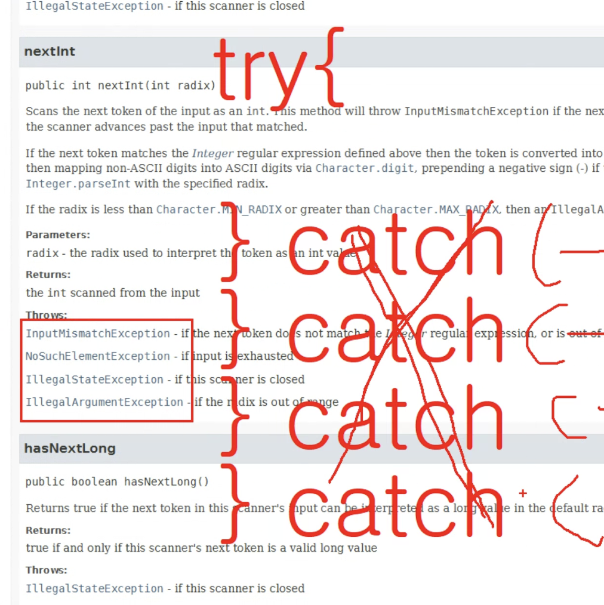

4번의 catch를 해줘야함 ---> runtimeerror로 한번에 잡아도 됨 ---> 에러로 잡기
(부모로 잡아도 된다)

```
 Scanner sc = new Scanner(System.in);
    System.out.println("숫자를 입력하세요");

    int num = 0;
    try{
      num = sc.nextInt(); -----> try-catch안에서 int num = ~~해주면 지역변수라 블럭 밖에서 사용 불가
    } catch(Exception e){
      e.printStackTrace();
    }
    System.out.println(">>> num : " + num);
    sc.close();

```

-----> try-catch안에서 int num = ~~해주면 지역변수라 블럭 밖에서 사용 불가
-----> 블럭 외에서 int num=0; (초기화까지) 해주고 해야함...!

## readline()의 IOException

### try-catch

```
  public String readConsole(){

    InputStreamReader isr = new InputStreamReader(System.in);
    BufferedReader br = new BufferedReader(isr);

    System.out.print("input data : ");
    String data = null;

    //data=br.readLine(); ---->//컴파일시점 Error발생

    try {
      data = br.readLine();
    } catch (IOException e) {

      e.printStackTrace();
    }

    return data;
  }
```

### throws

Throws 사용하면 --------> 나중에 사용할 떄 어차피 잡아야함 -> 던지지말고 잡아서 처리하자

```
  public String readConsole2 () throws IOException{

    InputStreamReader isr = new InputStreamReader(System.in);
    BufferedReader br = new BufferedReader(isr);

    System.out.print("input data : ");
    String data=br.readLine(); //---->//컴파일시점 Error발생

    return data;
  }
```

### throw, throws

`throw` : 예외를 터트림
`throws` : 예외를 잡는 것

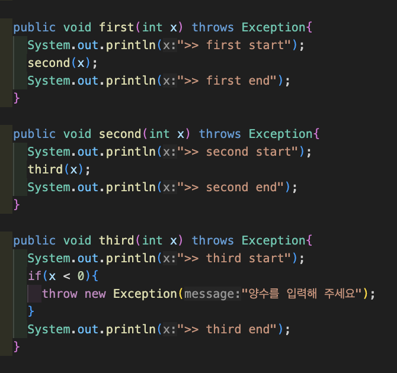
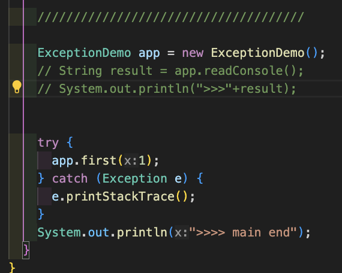

출력: 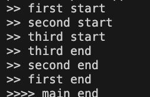

> 어디서든 한번은 예외처리가 필요함 !!!

## DAO(Data Access Object)

- db와의 작업을 담당하는 클래스
- 입력(C), 읽기(R), 수정(U), 삭제(D) : CRUD
- Structure Query Language (SQL) : DDL, DML, DCL, Select Query
