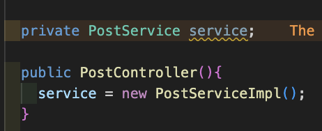
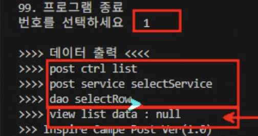
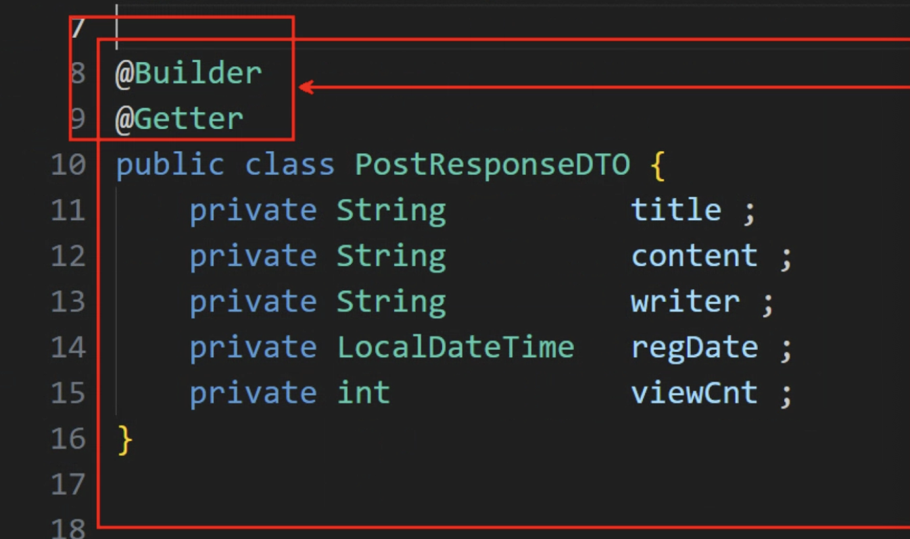
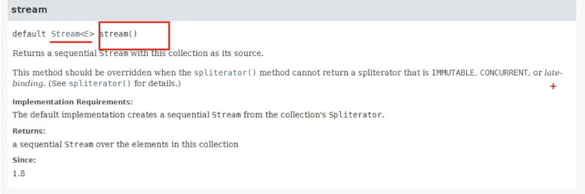

# DAY 18 (0814) - BE

stream API

lambda expression

Optional

---

### View ---- Controller

```
// Dependency Injection (DI)
  private PostController ctrl;
```

----> 의존성 주입

```
  public PostView(){
    sc = new Scanner(System.in);
    ctrl = new PostController();
  }
```

---

자바의 개발은 레이어드 아키텍쳐

---



PostService를 implements 하는 Impl을 생성할때 위와 같이 함.
근데 PostService를 implements 하는 Impl은 여러개 가능

-> 근데 전부 PostService의 요소들을 오버라이딩함 ---> 같은 것들 존재하지만 내용이 다를 것

---

### service ---- dao

---



ctrl --service --dao

---

Builder pattern



-> Getter 정도만 같이 함
@Setter, @Getter다 사용하면 Builder 패턴을 사용하는 이유가 없음

---

```
lgcns.inspire.post.domain.dto.PostResponseDTO@14ae5a5
lgcns.inspire.post.domain.dto.PostResponseDTO@7f31245a
lgcns.inspire.post.domain.dto.PostResponseDTO@6d6f6e28
```

--- @ToString --->

```
PostResponseDTO(id=1, title=mvc, content=springboot, writer=null, regDate=null, viewCnt=0)
PostResponseDTO(id=2, title=stream api, content=기초문법, writer=null, regDate=null, viewCnt=0)
PostResponseDTO(id=3, title=lambda, content=함수형 인터페이스와 연동, writer=null, regDate=null, viewCnt=0)
```

---

## stream api 이용해서 출력



### 기존 for

```
    for(PostResponseDTO data: list){
      System.out.println(data);
    }
```

## stream

```
    list.stream()
        .forEach(System.out::println);

/// PostResponseDTO(id=1, title=mvc, content=springboot, writer=null, regDate=null, viewCnt=0)
/// PostResponseDTO(id=2, title=stream api, content=기초문법, writer=null, regDate=null, viewCnt=0)
/// PostResponseDTO(id=3, title=lambda, content=함수형 인터페이스와 연동, writer=null, regDate=null, viewCnt=0)
m
```

### 특정속성에 대한 정보만 추출(title)

```

  list.stream()
      .map(PostResponseDTO::getTitle)
      .forEach(System.out::println);


/// mvc
/// stream api
/// lambda
```

### filter

```
  list.stream()
      .filter(post-> post.getId()>=2)
      .forEach(System.out::println);
```

## Stream API

- 원본데이터의 소스를 변경 X
- 일회용(한번 사용하면 재사용X)
- 병렬처리(thread)로 실행속도가 빠르다
- 작업을 내부 반복으로 처리(람다식이 필요)

### 함수형 인터페이스

- 가질 수 있는 메서드는 딱 하나

Supplier : 매개변수없이 반환값만 가지고 있는 것
Function : 매개변수를 받아서 반환값이 있는 것
Consumer : 매개변수를 받아서 반환값이 없는 것
Predicate : 매개변수를 받아서 Boolean 반환하는 것

---

### Optional
