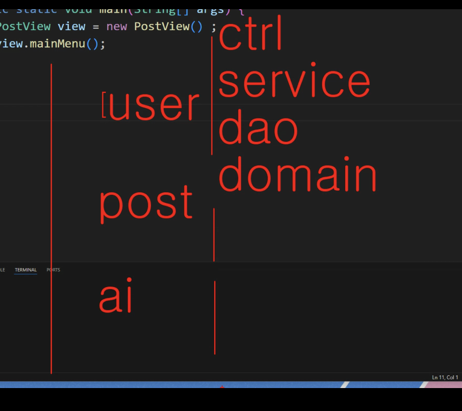
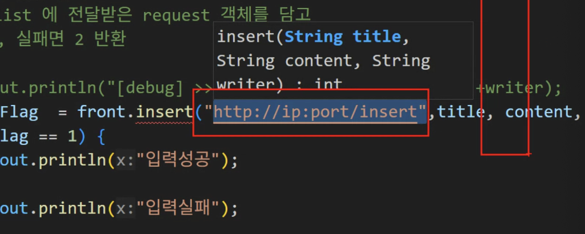
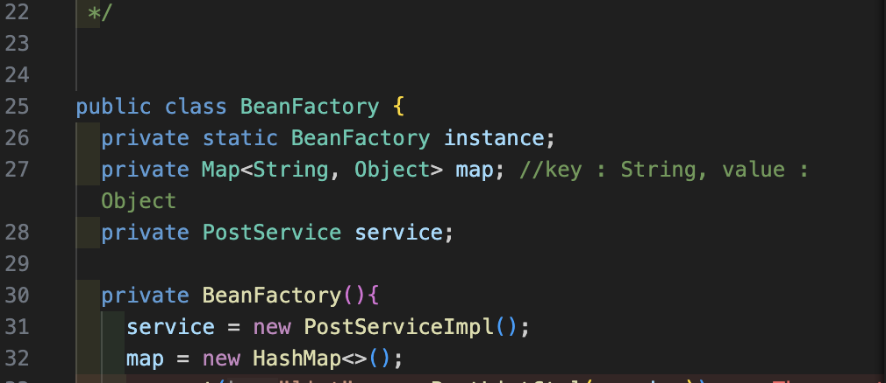
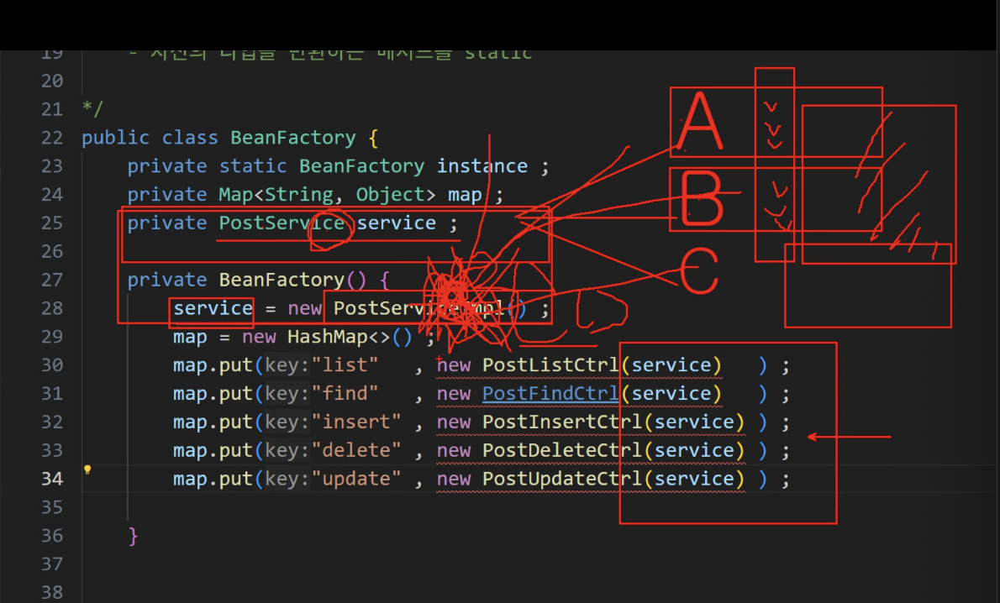
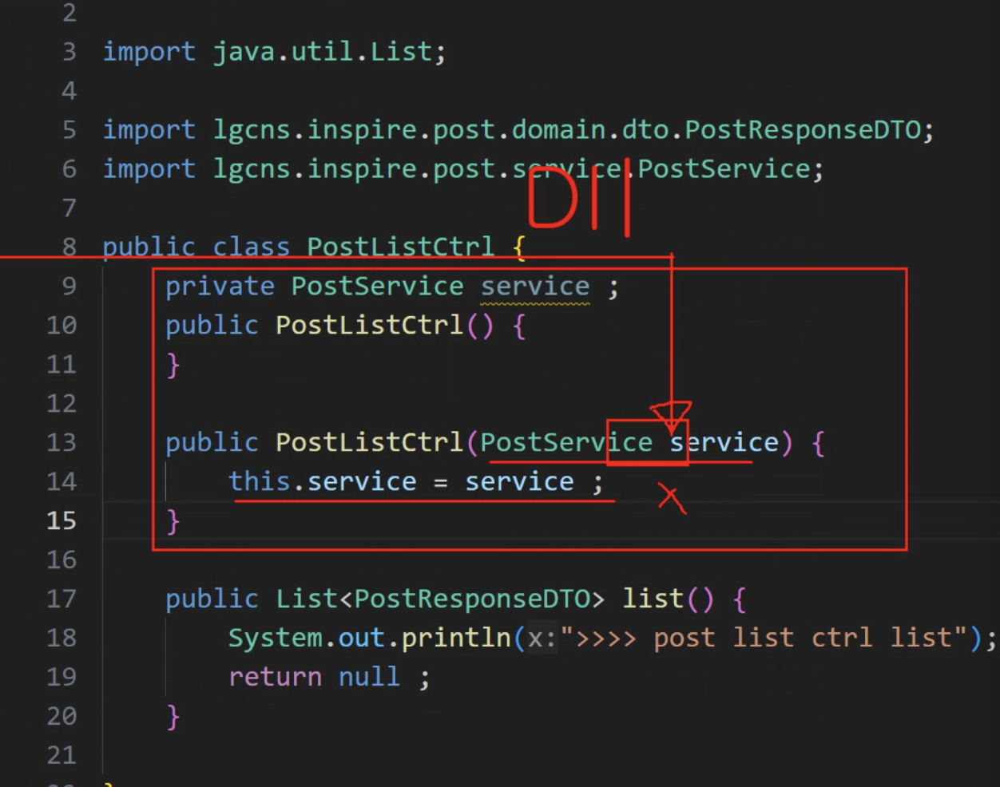
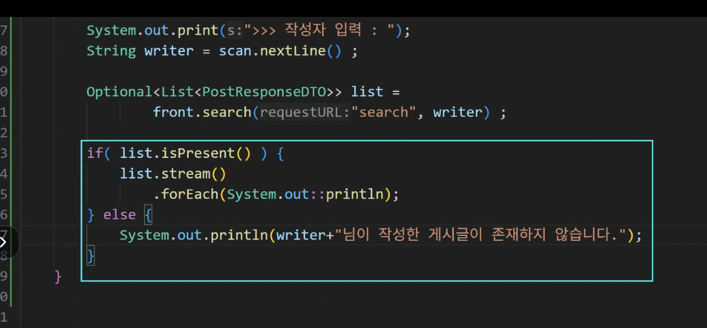
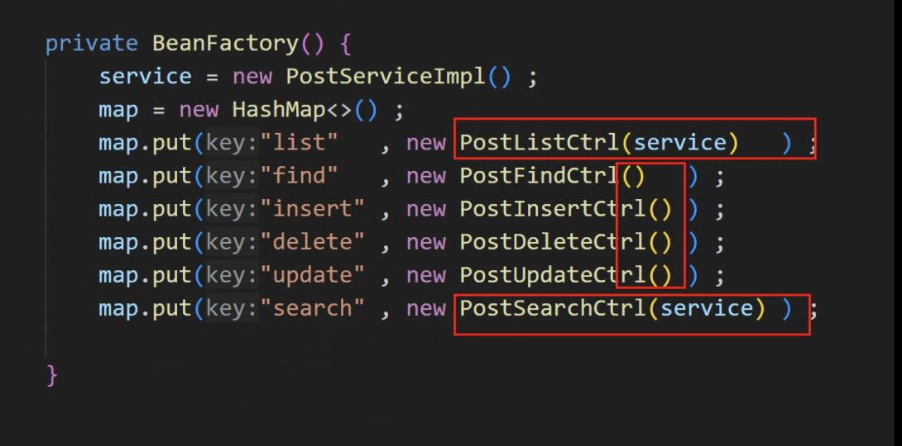
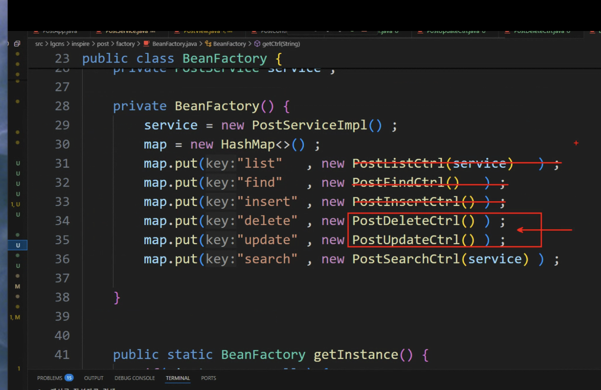

# DAY 19 (0818) - BE

### 이번주 계획

`프레임워크 아키텍쳐----->>----DB`

##

컨트롤러, DAO, Service---> 하나의 클래스를 만든다고 생각하면

: 객체지향의 장점을 살릴 수 없음

---

## Framework...(Spring)



user post ai 전부 ctrl,service,dao,domain 가짐

### 중앙집중화 ?

> 여러 컨트롤러(Controller)들이 각각 흩어져 요청을 직접 처리하면 흐름 제어가 분산됨 <br/>
> → 유지보수/확장 어려움
>
> 이를 해결하기 위해 공통된 진입점을 둠<br/>
> → 모든 요청을 한 곳으로 모아서 처리.

### front ctrl(facade pattern)

Front Controller(중앙 컨트롤러) 가 요청을 먼저 받고 나서 적절한 컨트롤러/핸들러로 분배

> 프레임워크 : 각각의 컨트롤러들과 관계 갖지마!<br/>
> -> front ctrl(facade pattern) 만들어둘거야

#### 방식?

factory를 만들어서 컨트롤러들을 등록시킴
프론트컨트롤러---->팩토리 ---->프론트컨트롤러---> 해당컨트롤러랑 연결?

## 실습

저번에 했던걸 frontController, BeanFactory 만들어서 수정

```
                                      Client Request
                                            │
                                            ▼
                             ------ ▶︎ Front Controller ==> 해당 Controller 실행  ====> View 반환
                           |               │
(URL -> Controller 매핑 조회)|               ▼
                            -----------  Factory


```

---

책 추천

### 갱오프의 23가지 디자인패턴

### 리팩토링

---

## QA ? --> 테스트 하는 사람

---

나중에 사용하면 이렇게 URL 넣음



---





레이어드 아키텍쳐 형식의 설계

-> 만약 serviceImpl을 A ---> B ---> C 업데이트 시키면 저부분만만 바꿔주면 됨



-> DI

## db :groupby(), partitioningBy()

## API 명세 만들기 ---> swagger

---

##

최종적 결과물 출력:



->

---



-> service 추가...?



Delete, Update 구현 완성 안했음
