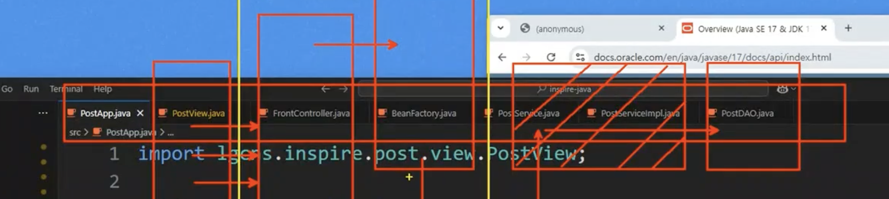
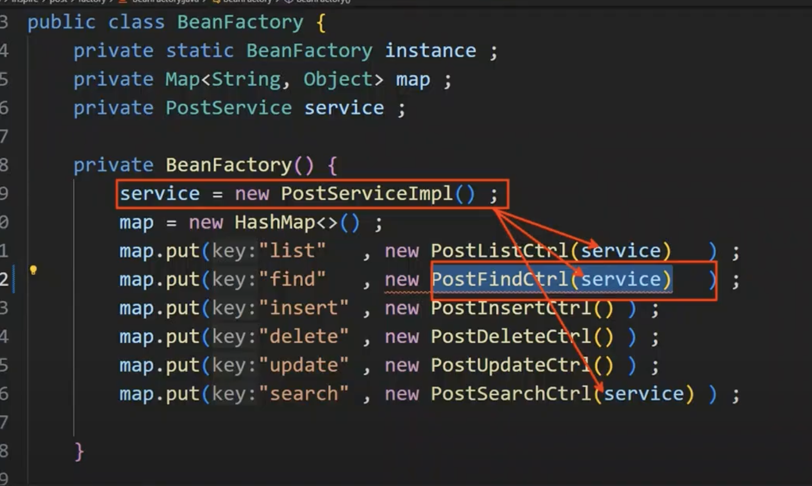
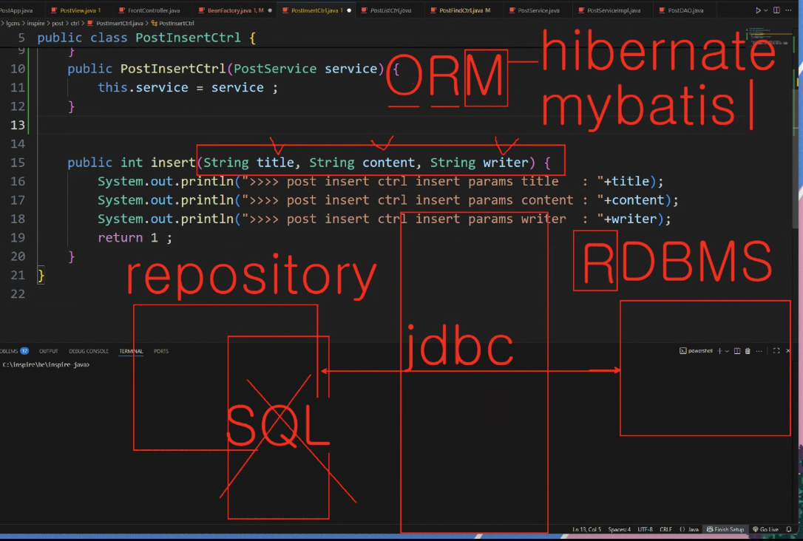
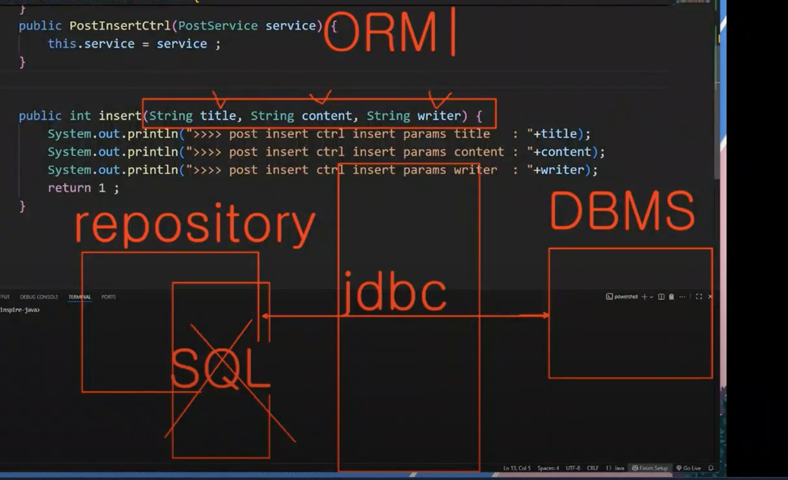
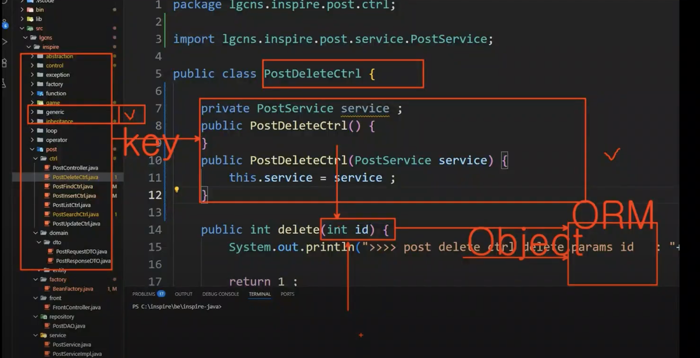
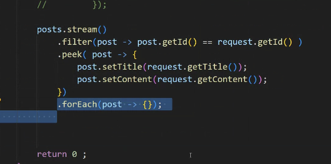
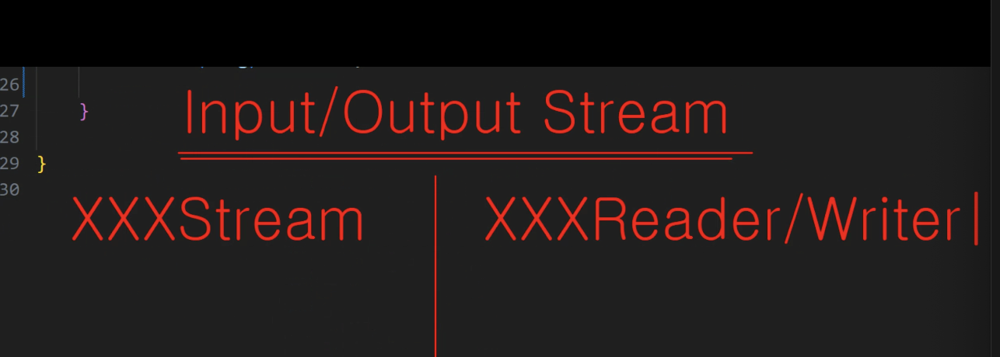
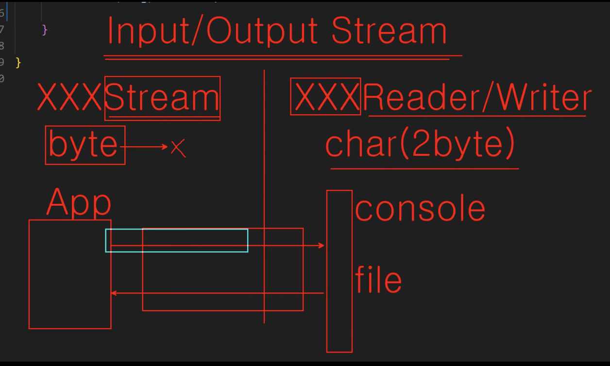
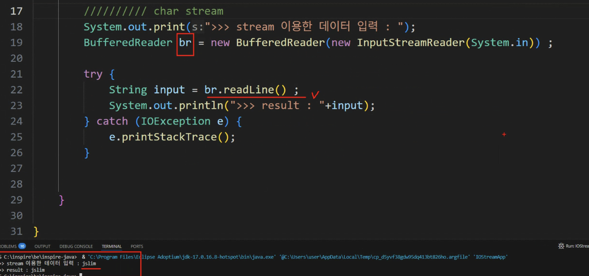

# DAY 20 (0819) - BE

남은부분 마무리 find, insert,delete,update

---



PostAPP.java PostView.java FrontController.java BeanFactory.java PostService.java PostServiceImpl.java PostDAO.java

- PostView가 React 대신
- FrontController는 Controller들 앞에 있는 컨트롤러. 모든 request들이 모여서 분배되는 곳이라고 생각하기 -> 위임을 하기 위해선 각각의 컨트롤러를 매핑하고 있는 팩토리 필요. -> BeanFactory
- BeanFactory에서 있으면 반환해줌 -> 그러면 FrontController는 해당하는 Controller에게 사용자의 요청을 전달함.
- 컨트롤러는 자신의 역할을 할 것이고 하지 못하는 건 Service에게 요청-> Service는 그 요청을 다시 DAO에게 전달함
- Service는 핑퐁하는 느낌임.

-> 실제 프레임워크 아키텍쳐로 넘어가게 되면 FrontController, BeanFactory 사라짐

그래서 컨트롤러가 응답하는 것처럼 보이지만, 실제론 FrontController가 주는 것.

---


singleton
하나의 Service로 각각의 controller들에 사용

---

### array가 아닌 stream으로 작업하는 이유?

대용량의 데이터...

로컬상에서 데이터를 가져오는 작업도 있겠지만, DB를 가져올 떄,,

대용량의 데이터를 정제하는 과정이 필요. 잘못됐을 때, 원본을 다시 가져와야함

원본데이터는 불러다 그냥 두고, stream 으로 가공된 데이터로 하기 위한......!! (+ 빠름)

최종적인 연산을 어떻게 하냐에 따라 새로운 subtype으로 만들어서 반환,,,

---



jdbc.... Java Database Connectivity



-> repository에는 SQL 쿼리구문을 추가했었지만 -> SQL을 매핑해주는 ORM을 사용

### ORM ---> O : 자바의 객체를 R : 관계형DBMS와 M : 매핑해주는 프레임워크들이 나오기 시작

1. hibernate (자동으로 SQL을 만들어버림)
2. mybatis (별도의 xml파일에 SQL작업)

--> hibernate는 현업에서 구현하는 SQL구문들을 유연하게 관리하기엔 복잡성이 커서 사용 ㄴㄴ하고 mybatis를 많이 사용
---> 단순한 CRUD라면 : JPA기반의 hibernate 추천,

#### 현업에선 mybatis를 기준으로 단순 CRUD라면 hibernate로 혼용해서 작업

---

### boxing, unboxing



boxing : 기본을 객체로 만드는 것
unboxing : 객체를 기본으로 만드는 것

int id 로 전달해도 되지만 경우에 따라선 문제가 생길 수 있음

1. Integer id 로 수정 (기본 데이터 타입 사용 x) ---> 좋은 방법은 아님
2. Map에 담아서 전달하기
   ```
   Map<String, Integer> map = new HashMap<>();
   map.put("key", id); // key값으로 int id를 담는 것
   ```

---

Dao Repository Mapper를 ORM과 연동하는 식으로 사용하다보니,, ORM과 연계하는 식으로 바뀜..
Service에서 업무로직을 처리하는 경우가 많음.

---

업데이트...
stream이 가지고 있는 peek()...: 원본 리스트 안에 객체 속성을 변경할 수 있음



---



XXXStream : byte 단위로 이동 !
XXXReader/Writer : char(2byte)

App ---> Web



java의 stream은 단방향으로 흐른다...
하나의 stream으로 데이터를 양뱡향으로 이동 못함
입력스트림, 출력스트림 둘다 필요.

### charStream



IOStreamApp

### Serializable ?

객체 직렬 ?

마킹인터페이스 ?
