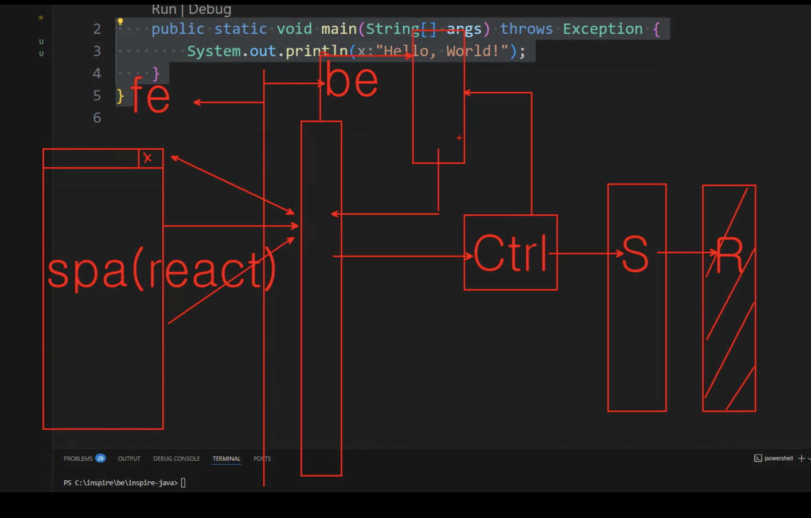
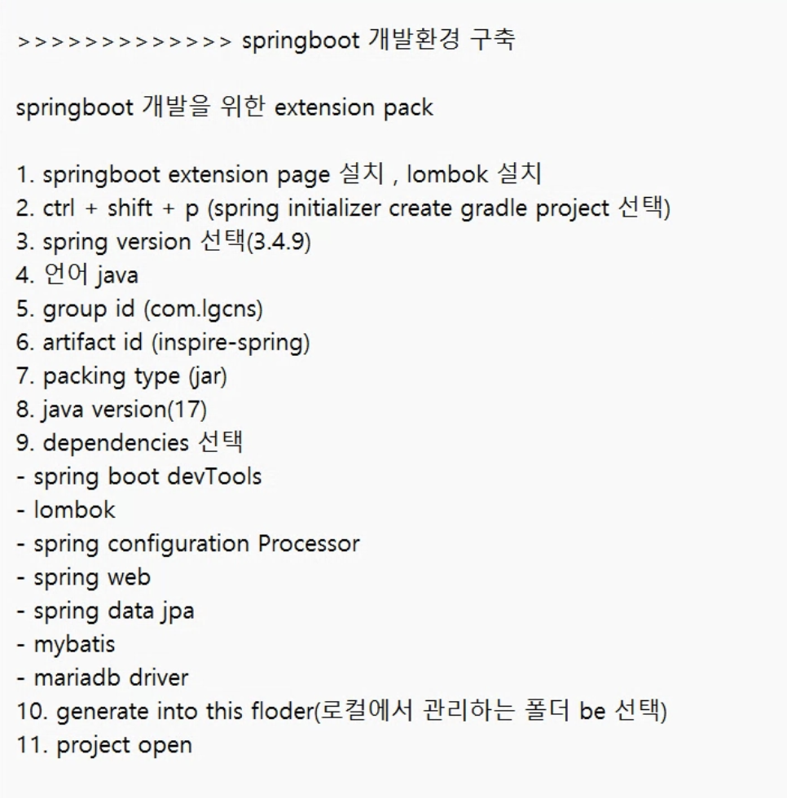
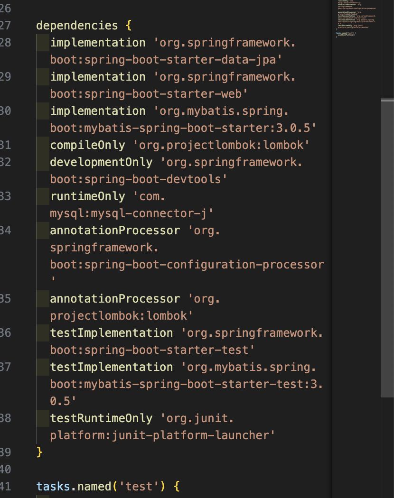
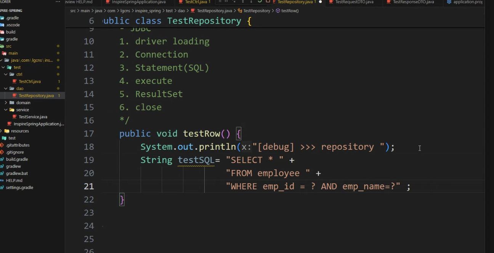
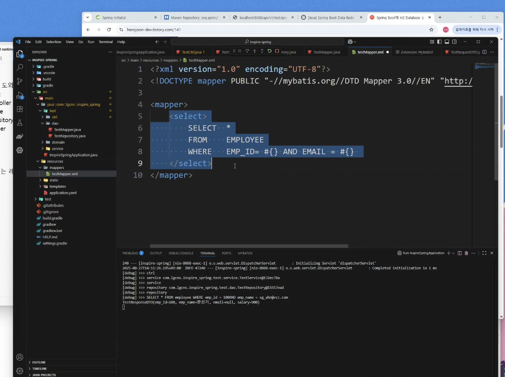

# DAY 26 - 0827 : SPRING



마지막 R부분에 SQL 들어감' ----> JDBC
---> 원격에 있는 DBMS와 통신하기 위해 프레임워크 사용 (ORM..--마이바티스?? JPA??)

spring에서 frontcontroller, factory 들어있음
---> controller, service, repository 만 만들면 됨
@Anotaion

---



---

project build

```
- maven (pom.xml) ---------
                           |--> lib를 dependency로 넣어둠
- gradle (build.gradle)----

```



build.gridle

- dependencies

---

- main
  - static--> css, sript, img -->쓸일이없음
- test ----->junit 할때

---

HTTP API 설계

GET /users
GET /users/{id}
POST /users
PUT /users/{id} <----사용자 전체 수정
PATCH /users/{id} <----사용자 일부 수정
DELETE /users/{id}

HTTP State Code

- 200 OK
- 201 Created OK
- 204 No Content : 성공했지만 응답 바디가 없음

- 400 : Bad Request 요청 오류
- 401 : Unauthorized : 인증
- 403 : Forbidden : 권한 없음
- 404 : Not Found : 리소스 없음

- 500 : Internal Server Error : 서버오류

---

응답 포맷(json)

버전관리 (API Versioning)

Get /api/v1/users
Get /api/v2/users

---

문서화작성 도구

- Swagger
- PostMan

---

Anotaion
---> 전부 @Component를 상속받음

@Controller
@Service
@Repository
@Mapper
@Entity

---

API 명세를 도와주는
@RequestMapping

---

Inversion of Controll

- DependencyInjection(DI) : 의존성 주입
  - @Autowired, @inject, @Qulifierd, @Resource
  - constructor injection
  - setter injection
- DependencyLookup (DL) : 객체를 찾는

---




