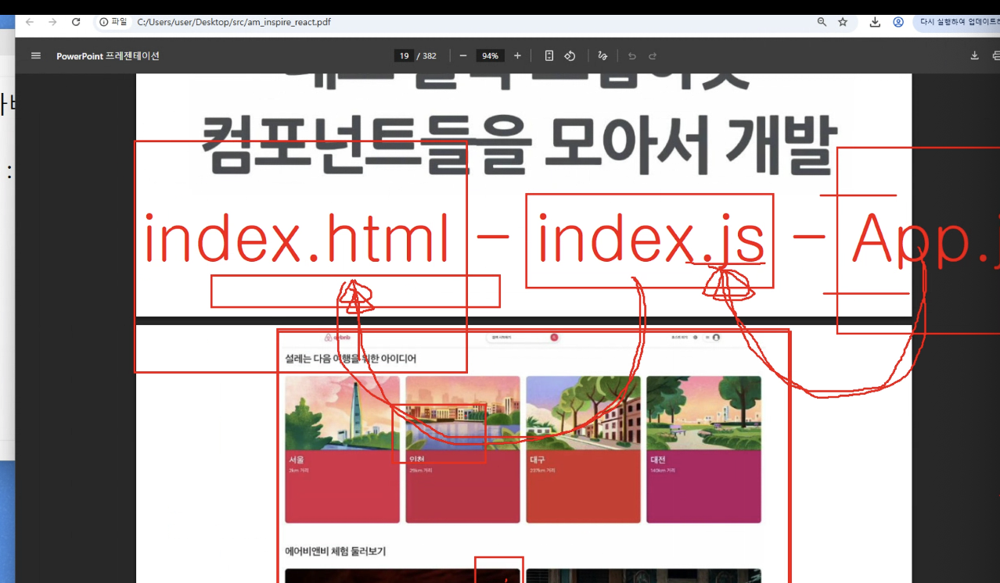

# 0731

- git 다운로드
- node.js 다운로드

node.js : js로 app개발을 도와주는 환경

Npm(node package manager):다양한 외부라이브러리를 설치 및 삭제를 도와주는 기능

- 의존성 관리

# React

라이브러리 ?

사용자 인터페이스 UI

Vue -> 프레임워크

프레임워크는 생명주기가 정해져있지만
라이브러리는 개발자가 관리할 수 있음

### 리액트의 장점

빠른 업데이트 & 렌더링 속도

- virtual dom..
- component-Based

프로젝트 개발 방법론으로 요즘 애자일 방법을 많이 사용하는데, CBD(oop에서 나옴)

.jsx 는 내부적으로 function을 가짐 -> 하나하나가 컴포넌트..?

java에서 class는 붕어빵틀같음
객체를 만들어내기 위한 틀...

컴포넌트도 틀이라고 생각하기

이런구조 사용


## 시작하기

```
npx create-react-app 프로젝트 이름
npx create-react-app inspire-react
```

기본적으로 여러가지 설치가 됨

- Babel : 코드를 구형브라우저에서 실행하도록 변환해주는 도구(jsx->js)
- ESLint : 스크립트코드의 문법 오류나 스타일 문제를 분석해서 알려주는 툴
  - naming convension
  - 미사용변수, 오타

## 서버가동

```
npm start
port-4000 npm start //포트 지정해서 가동
```
