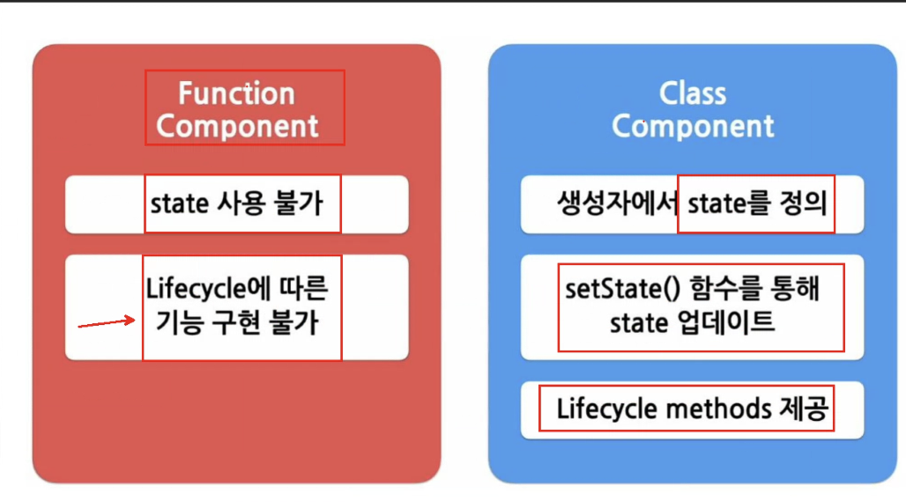
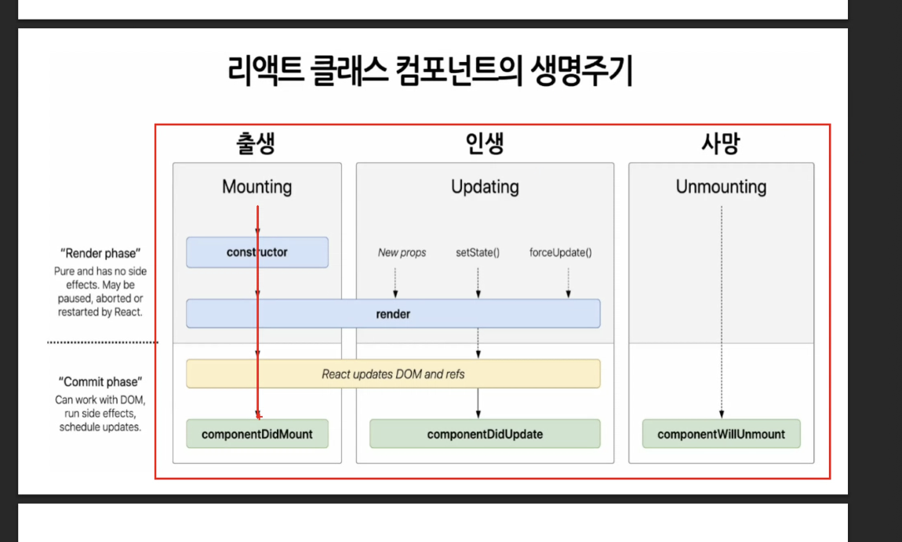
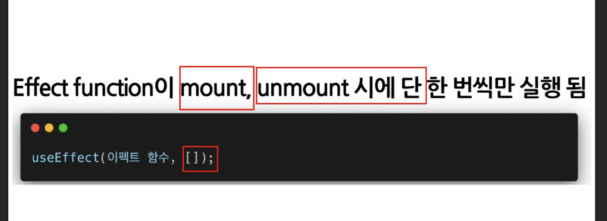
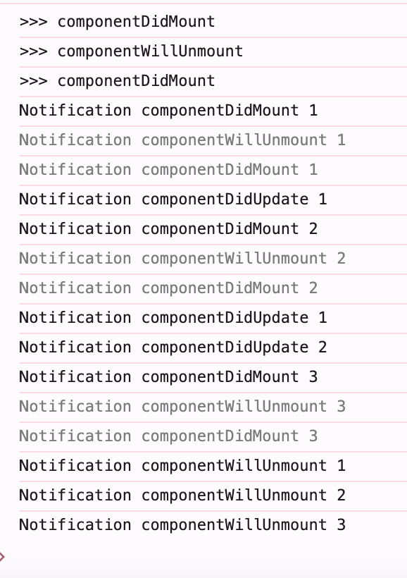

# 0801 DAY 9



## useState

## useEffect

->side effect를 수행하기 위한 hook

- 랜더링 중에 일어날 수 없음
- useEffect(이펙트함수, 의존성배열)

  

  

```
  //side effect
  useEffect(() => {
    console.log(">>>useEffect"); //렌더링 될때마다 출력됨
  });

    //side effect
  useEffect(() => {
    console.log(">>>useEffect"); //마운트 시에 출력됨
  }, []);
```

### UseMemo

-> tjdsmd

### UseCallBack

## useRef()

내부 데이터가 변경되었을 때 별도로 알리지 않음

## Hook의 규칙

- 최상위에서만 호출..

# Custom Hook 만들기

## react는 one-way 데이터 플로우 방식을 선호함

부모->자식
: 데이터에 대한 흐름을 예측하기 쉽기 때문임


