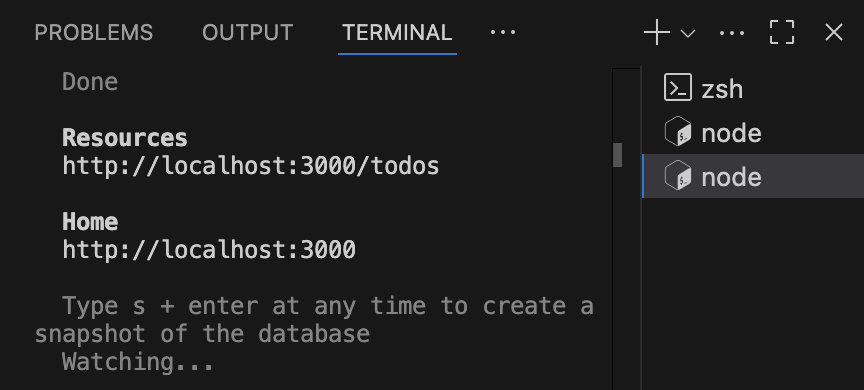

# DAY 10 (0804 MON)

## Handling Event

### Forms


-> 기본적인 html의 form
name 속성필수 ...

SPA기반의 통신과정을 가진 REACT는 name이 아닌 id가 중요

sync가 돼야함 -> 리액트 컴포넌트에 관리가 되어야함...

### form > SignUpPage.jsx

value, on


### props 드릴링 할때 해결 방식?

> > Context 사용

#### button에 submit 되게 해도 되고, form태그 안에 onSubmit도 가능


```
npm install -g json-server@0.17.0
```

### axios 설치

```
npm install axios
```

### react-router-dom styled-component

```
npm install react-router-dom
```

```
npm install styled-components
```

### json 서버 기동..

```
json-server --watch db.json
```

에러발생하면..?

npx json-server --watch db.json

전체 루트 디렉토리에 db.json 생성



> 터미널 두개로 두개 다 기동


```
json-server --watch db.json --port 4000
```

### 컴포넌트의 props를 통한 데이터 전달

## useEffect 도 신경 써줘야 함

### PUT, DELETE, PATCH : 204 요청은 성공했고, 서버로부터 전달되는 콘텐츠가 없을 때

### PUT & PATCH-> 차이 ?

> put : 데이터 수정 (리소스 전체를 수정하거나, 새로 생성)
>
> patch : 데이터 일부 수정 (업데이트시에는 patch 사용하는 것이 더 좋음,,!)

## 더 정교하게?

try-catch...해주기..!


##


내려오는 데이터의 헤더에 엑세스토큰을 담아서 옴.
전역으로 공유하려면 토큰을 심어야 함
-> 로컬스토리지, 세션스토리지..

로컬 : 브라우저 영구 보관
세션 : 페이지가 닫히면 사라짐

-> useState 이용해서 넘겨줘도 됨

쿠키 : 서버쪽에서 작업..! (가장 안전함)


이렇게도 가능함

### useLocation

## Context

컴포넌트의 props를 통해 데이터를 전달..

-> 로컬스토리지/세션스토리지랑 병행해서 사용해야 함


provider consumer

: 여러개의 components 들이 접근해야 하는 데이터

: 로그인 여부, 로그인 정보, UI테마, 현재언어 등등...

### Context API

`React.createContext()`

```
React.createContext(기본값)

<MyContext.Provider value = {{something:'something'}}>

MyCont~.consumer
```

전역으로 사용하려면 provider로 둘러줘야함.
contextApp.jsx 만듦.

contextAPP > Page > header/body/footer 전달 : 드릴링

contextAPP : Provide 해주면 전역으로 가져다 사용

> 원래라면?


> router 같이 사용 가능함
> 

context 사용하면 .. 새로고침하면 다 날라감..
휘발성이기 때문에 로컬스토리지나 세션스토리지를 연계해서 사용 해야함..

-> 연계하기 복잡해 ~~ : 나중에 쿠키 사용하면 됨 !

: 나중에 JWT 배울때 프론트 연결해서 알려주실 예정 !!
