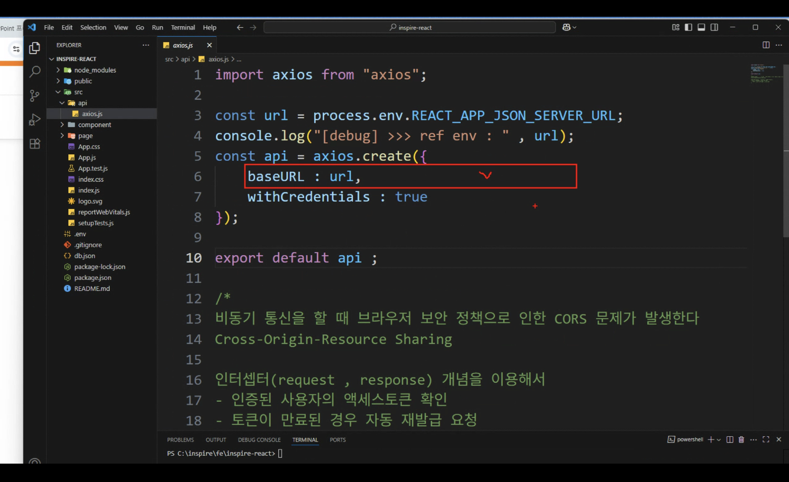

## env 파일

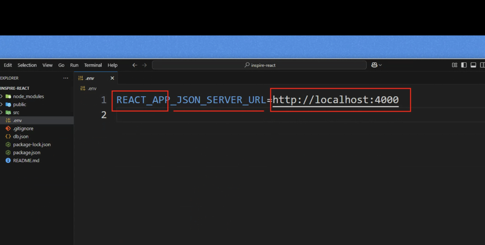

.env 파일에 정의한 환경변수는` REACT_APP_`으로 시작해야만 브라우저 환경에서 접근할 수 있음

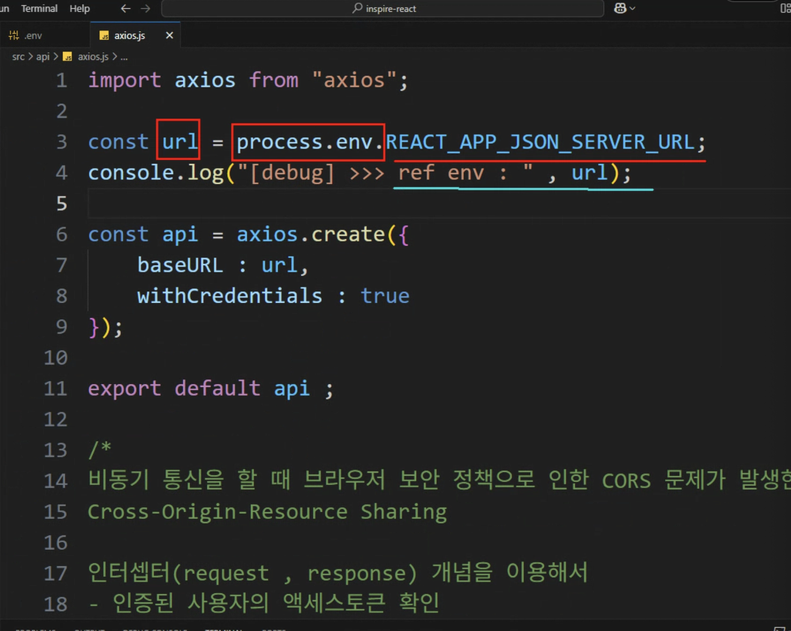

->이런식으로 바꿔주면 보안쪽으로 좀 더 좋음

포트 실행
`json-server --watch db.json --port 4000`

# 실습 수업 - 미니 프로젝트

미니 블로그 만들기 !

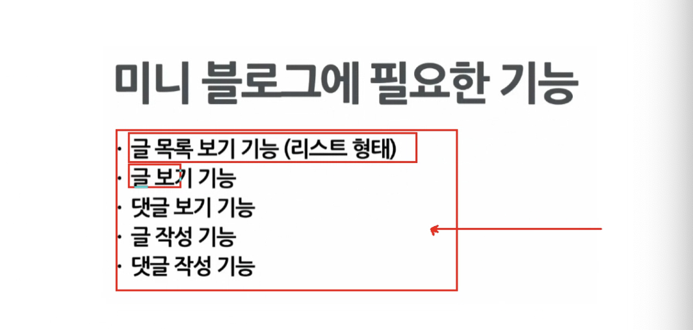

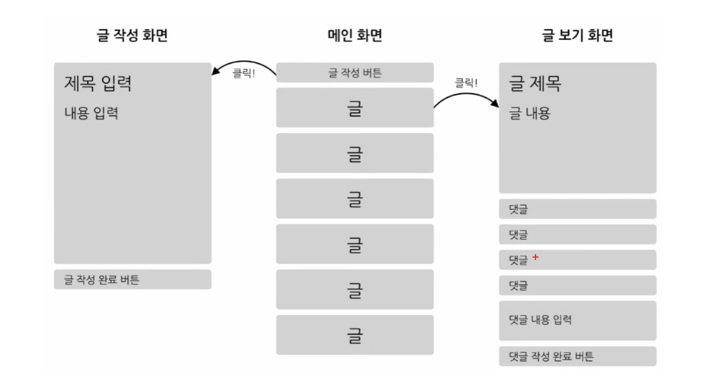

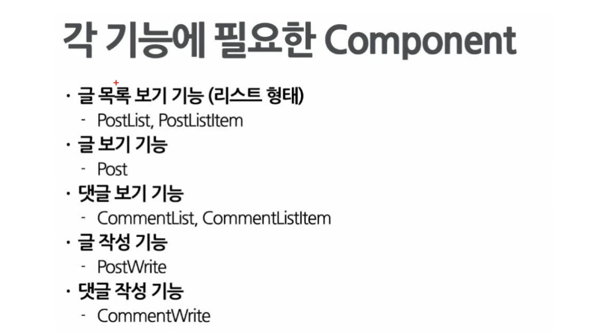

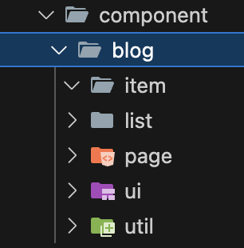

BlogApp.jsx 만들어서 index.js에 먼저 등록해주기

util 폴더에 전역으로 사용할 것들이 있으면 넣고 관리하기 !!

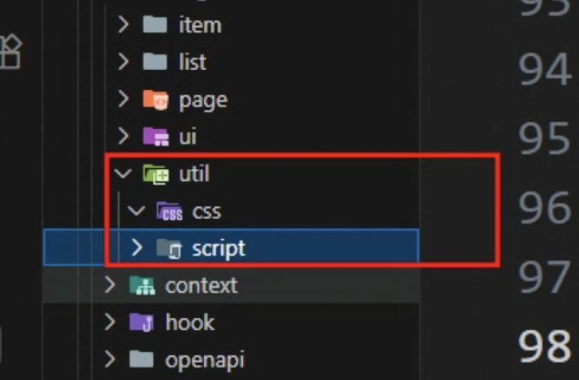

## 경로..

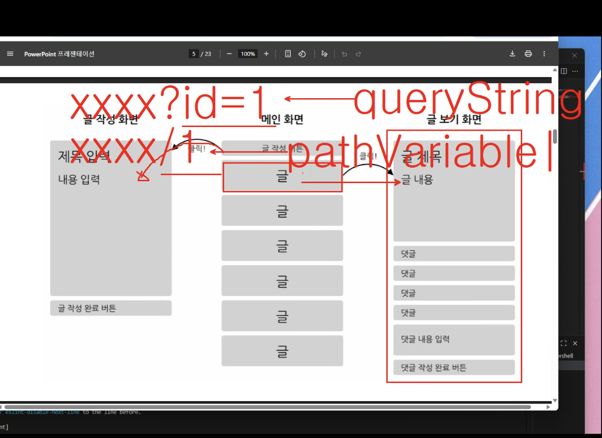

SPA에선 쿼리스트링보다 path value로 하는 경우를 더 선호함

### usEffect

[] 생략하면 컴포넌트 업데이트 될 때 마다,, 렌더링

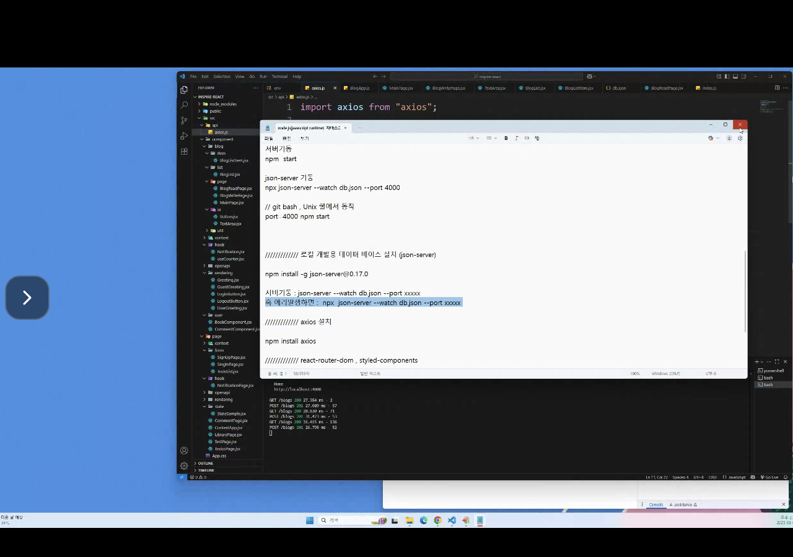

```

  const [blog, setBlog] = useState({});
  const getBlog = async () => {
    //api get()데이터 가져온 후 해당 데이터 state 상태로 만들어보자.
    // queryString : http://Xxxxxxxxx/blogs?id=1
    // path variable : http://Xxxxxxxxx/blogs/1
    try {
      // 1. queryString //
      // 이경우에 배열로 내려오기 때문에 [0]해줘야함
      // res.data[0]
      //
      // const res = await api.get(`/blogs`, {
      //   params: { id: blogId },
      // });
      // setBlog(res.data[0]);
      // console.log(res.data);

      // 2. path variable
      // 객체로 받아서 바로 res.data
      const res = await api.get(`/blogs/${blogId}`);
      setBlog(res.data);
      console.log(res.data);
    } catch (err) {
      console.log(err);
    }
  };

  useEffect(() => {
    getBlog();
  }, []);

```

블로그 하나에 여러개의 댓글
-> blogId 가 외래키 식별값으로 전달이 돼야함.
(comment 자체의 id는 별개 !)

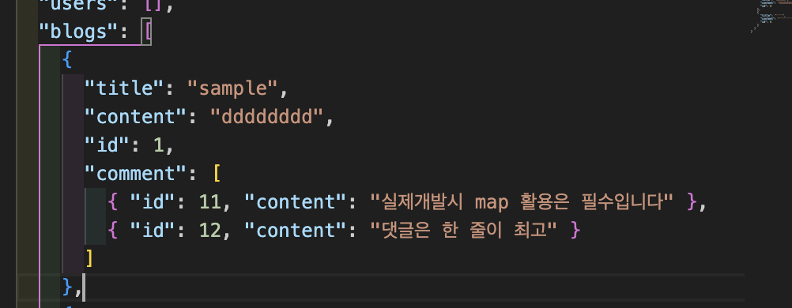

> 이렇게 하나의 블로그 데이터안에 같이 넣어도 되고
>
> 아래처럼 따로 blogs 처럼 comments를 해주는 방식으로도 가능함.

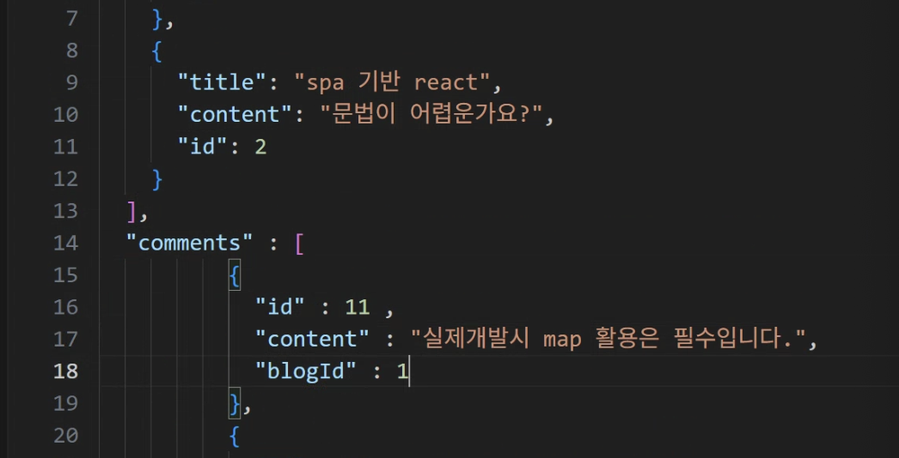
-> 1대다의 관계
