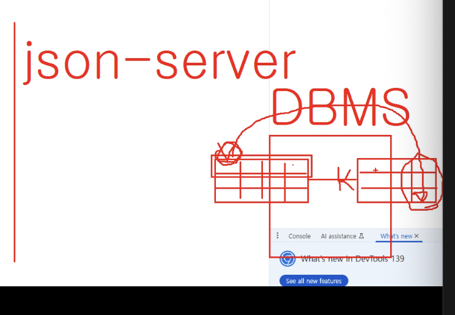

# Day 12 0806

https://home.openweathermap.org/

json-server

DBMS..




이런식으로 지원하지가 않아서 댓글 업로드가 어려움..


1. 이 구조로 수정하기....
2. 댓글 등록되게
3. 댓글부분만 리렌더링 되도록 분리

공공데이터

---

### OpenWeatherAPI

API > WeaatherAPI > CurrentWeatherAPI > API Doc

리액트 전용 부트스트랩 ( 대문자로 시작하는 컴포넌트)

npm install react-bootstrap bootstrap

---


### optional chaining

```
const obj = { name: "jslim", age: 20 };
console.log(obj?.name); // obj가 null일 경우 undefined을 반환함
```


