# 25.07.24 : FE

## HTML

### 웹 트랜드의 변화 ?

- 예전엔 **페이지 전체를 전달** → 요즘은 **JSON(데이터)** 만 전달

- 웹 동작을 위해서는 ‘브라우저’와 ‘에디터’ 필요 ⇒ vscode, Cursor AI

- FE는 브라우저에서 동작(정적) :

  - `HTML(tag+text)`, `CSS(스타일)`, `JS(이벤트처리)`

- 동적 페이지 :

  - HTML문서에 코드가 삽입되어야 함 ⇒ .jsp / .asp / .aspx 확장자

- 웹은 **요청 없으면 응답 없음** ⇒ 응답 = jsp 페이지를 전달하는 것

### → JSON

- `JAVA`는 타입이 명확, `Script`는 타입 없음 → JSON이 두 언어를 연결

  - JAVA는 컴파일 언어라 변수 앞에 ‘타입’을 가지고있음

  - Script는 변수 타입 없음 ⇒ JSON이 JAVA변수 타입을 Script가 알 수 있게 변환

### → SPA(Single Page Application )

- 하나의 HTML 안에서 컴포넌트 단위로 구성

- 대표 라이브러리/프레임워크:
  - `angular` / `react` / `vue`

`<!DOCTYPE html>` : 현재문서가 html5로 작성된 문서임을 나타냄

---

## Bootstrap

→ 반응형 웹의 템플릿 제공

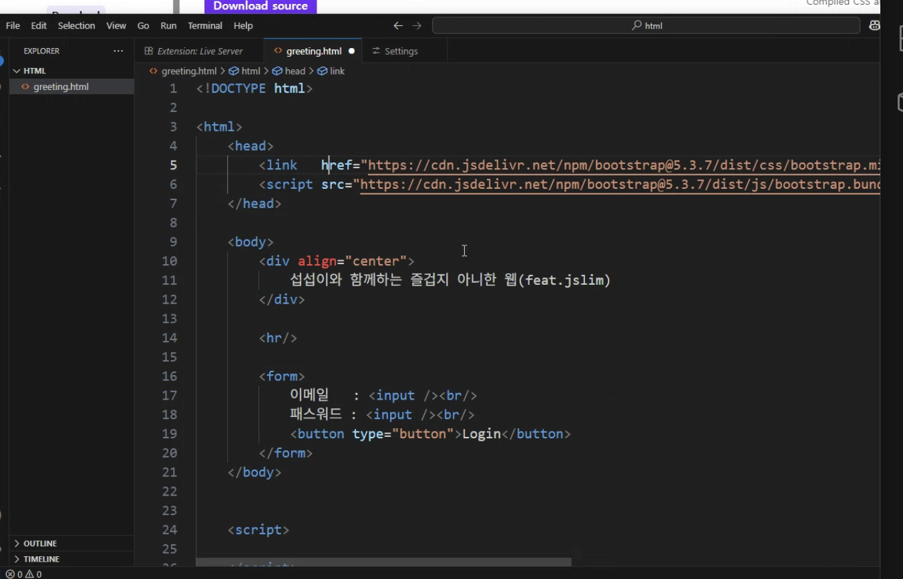

- `<head>` 안에 불러와서 사용 : 헤더에 넣음

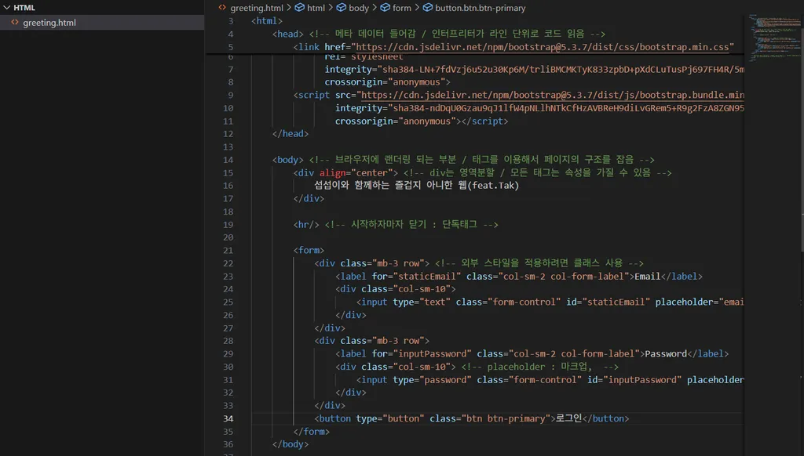

> React는 컴포넌트 기반

> 태그는 소문자 사용 권장 (컴포넌트는 대문자로 구분하는 경우 많음)

- 태그는 대소문자 구분을 하지않지만 소문자로 쓰는 것을 권장.

  → 컴포넌트를 태그처럼 불러오아 사용하는 경우가 많은데, 대문자를 주로 사용하기 때문

---

## 태그의 속성

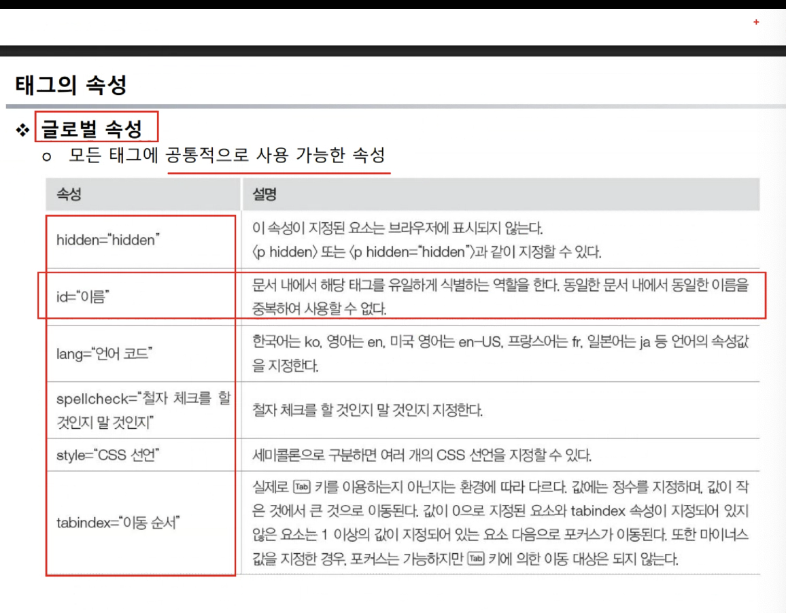

---

## Event

#### Event : 이벤트 행위 : 클릭

#### Event Source : 이벤트를 받는 대상 : 버튼

#### Event handler : 이벤트 처리하는 영역 :

---

## SPA

Single Page Application

우리가 만들건 결국 SPA이다. SPA는 싱글페이지로 구성되어있기에, 결국 지금의 a 태그를 사용 안함.

⤷ 하나의 html에 컴포넌트 단위로 함

```
    <a href="./login.html">로그인 페이지 이동</a>
    <a href="javascript:alert('클릭')"> 자바스크립트 호출</a>
```

### _⤷ 몰랐던 부분_

`<a>태그`의 href에 alert같은 함수도 넣을 수 있다.

대신 앞에 `javascript:`를 붙여줘야 함

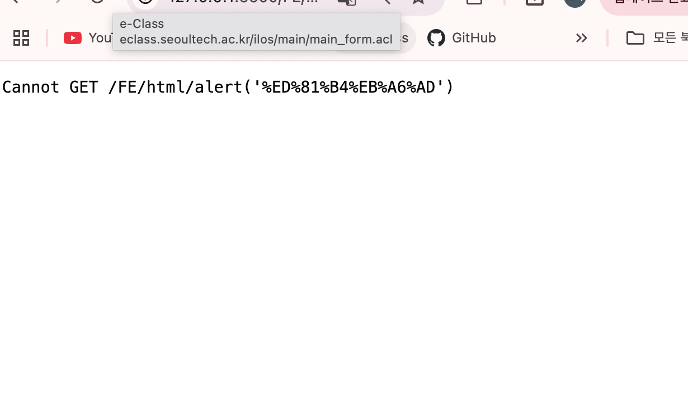
⤷ `<a href="alert('클릭')"> 자바스크립트 호출</a>`

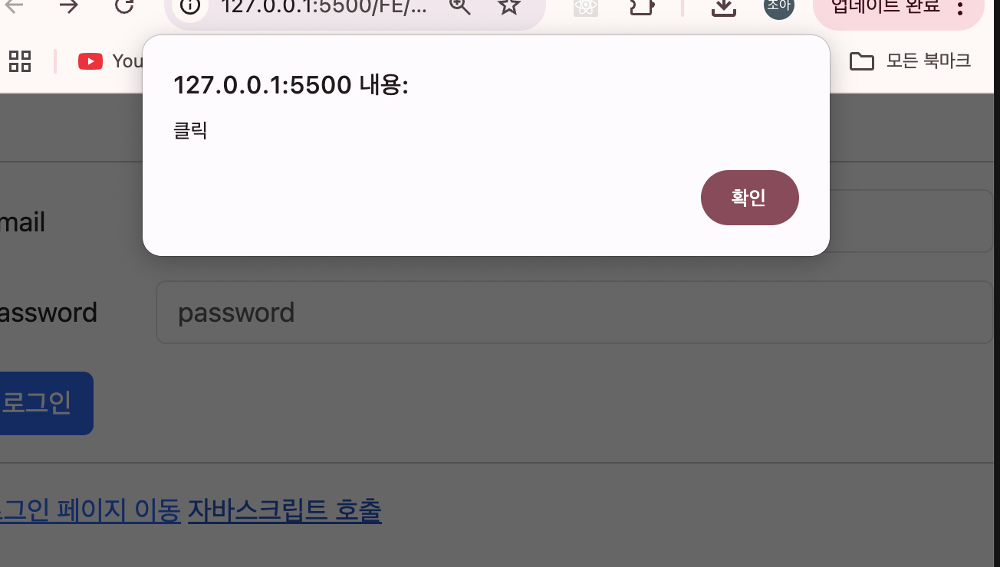
⤷ `<a href="javascript:alert('클릭')"> 자바스크립트 호출</a>`

---

## 통신 ?

- fetch API
  - promise 기반
- axios API
  - fetch보다 사용 편리

⤷ 둘다 async 비동기 통신

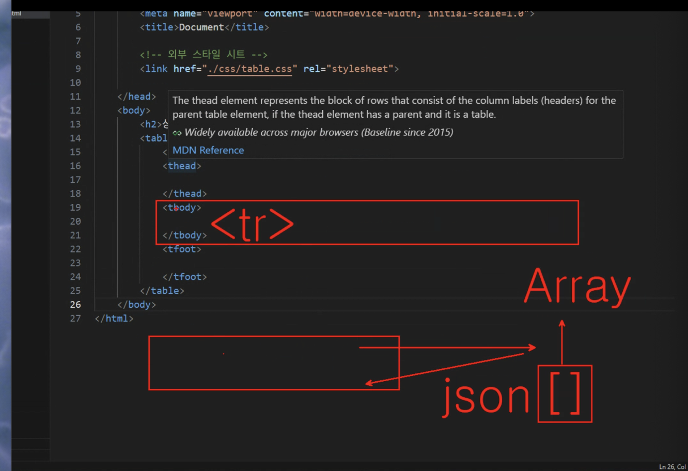

---

## 테이블 구성

⤷ 보통 tbody에는 id를 준다 !

```
      <tbody id="tbody">
        <tr>
          <td>선물용</td>
          <td>3kg</td>
          <td>11~16과</td>
          <td>35,000원</td>
        </tr>
        <tr>
          <td>선물용</td>
          <td>3kg</td>
          <td>11~16과</td>
          <td>35,000원</td>
        </tr>
      </tbody>
```

⤷ 아래처럼 `rowspan`으로 해도 됨!

```
      <tbody id="tbody">
        <tr>
          <td rowspan="2">선물용</td>
          <td>3kg</td>
          <td>11~16과</td>
          <td>35,000원</td>
        </tr>
        <tr>
          <td>3kg</td>
          <td>11~16과</td>
          <td>35,000원</td>
        </tr>
      </tbody>
```

⤷ 열 합치기도 가능 : `colspan`

```
      <tfoot>
        <td colspan="4"><center>상품요약</center></td>
      </tfoot>
```

⤷ 간단한 css 주면?

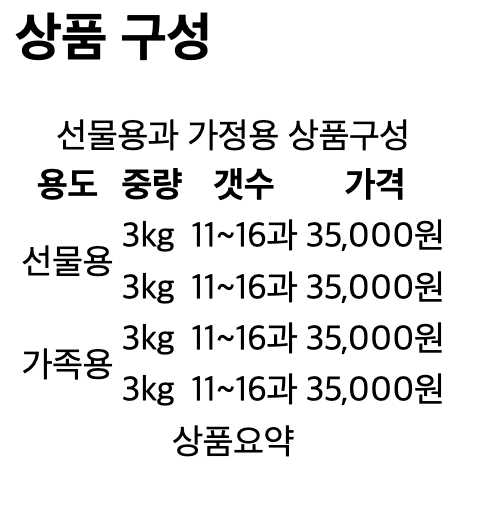

```
#table,
th,
td {
  border: 1px solid red;
}
```

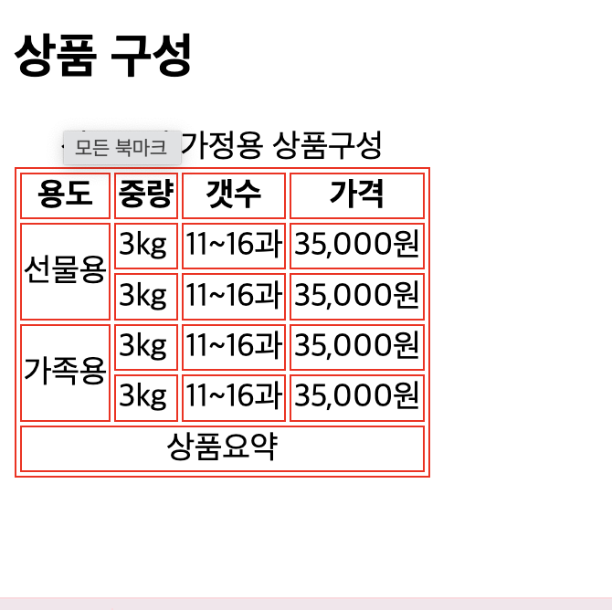

⤷ 패딩 추가?

```
th,
td {
  padding: 10px 20px;
}
```

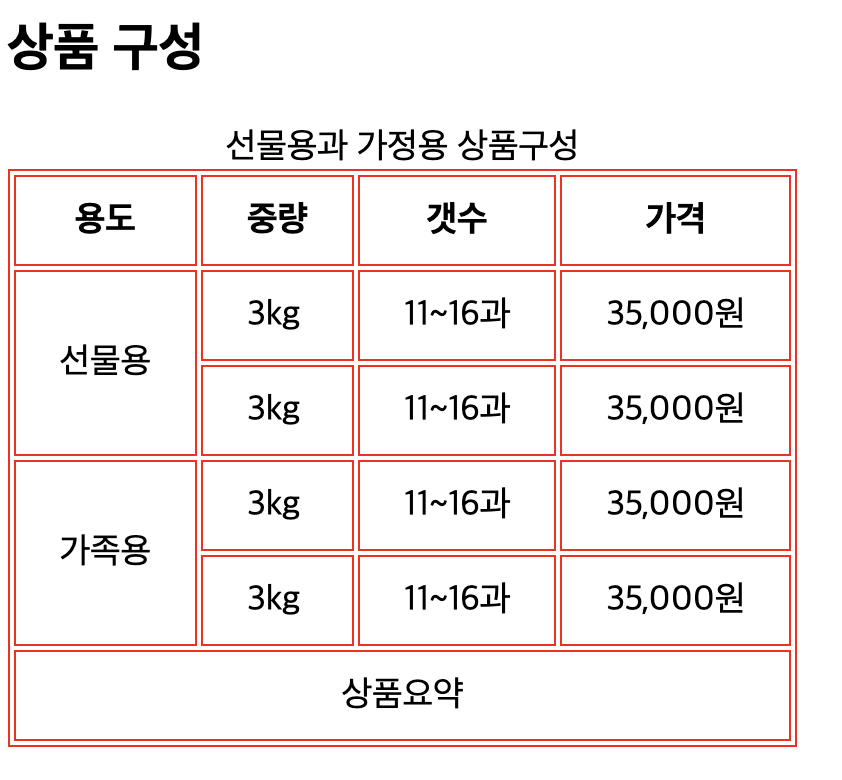

⤷ ` border-collapse: collapse;` 추가?
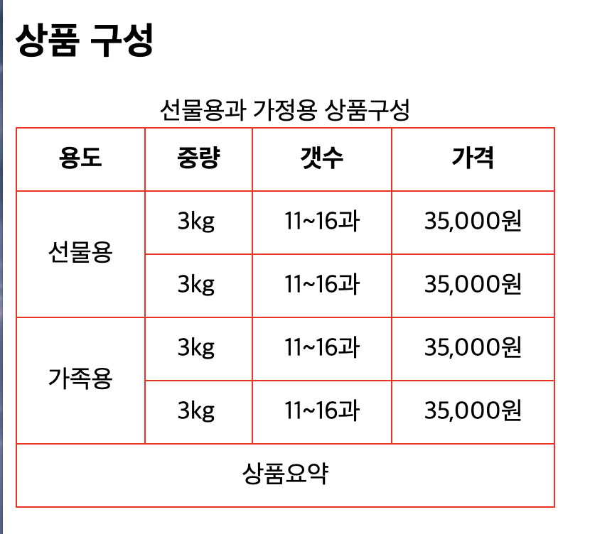

### ⤷ 몰랐던 부분 ?

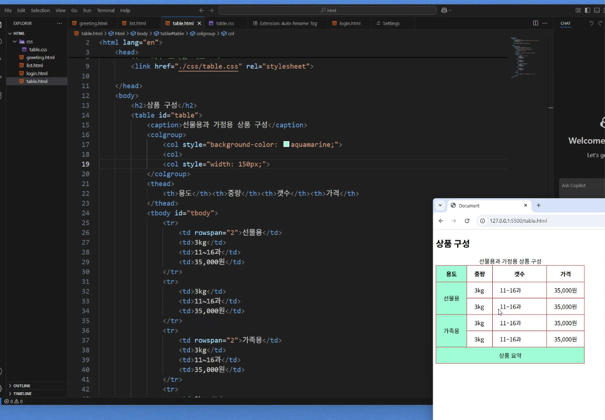

`<colgroup>` 으로 body안에서 디자인 수정 가능함

---

## Form + Input

인풋에 name넣고 `<form action="./thanks.html" method="get">`로 넘기면

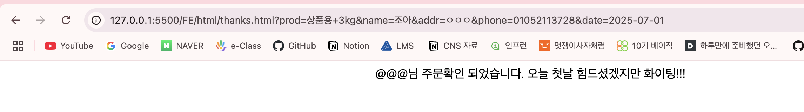

이런식으로 name 속성을 넣으면 param으로 넘어감

다만 SPA 방식에서는 보통 id 기반으로 처리

→ name을 반드시 쓰진 않음
