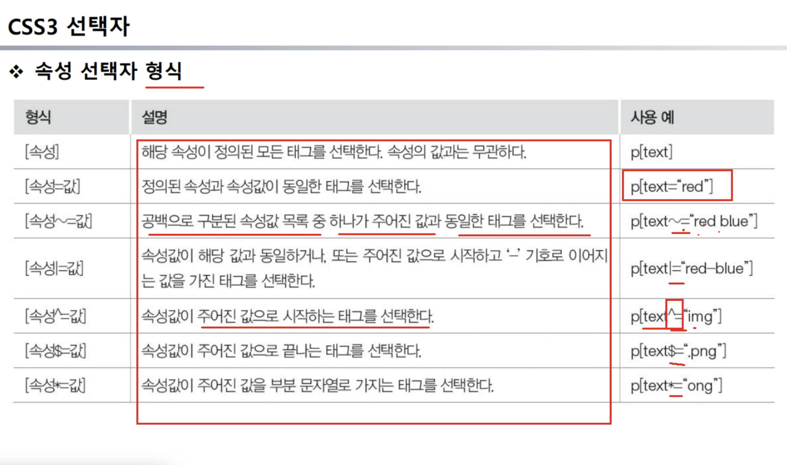

# 25.07.25 : FE

### CSS 선택자

- 클래스
- id
- 태그
- 속성 선택자
  

### CSS 가상 선택자

- 웹 문서에는 보이지 않지만, 이벤트 행위에 따라 스타일 시트 적용

- hover, link, action, visited ...

-> 두개의 fieldset

---

```
    <form id="signUp">
      <fieldset>
        <legend>회원가입 정보</legend>
        <ul>
          <li>
            <!-- label 태그 사용하는걸 권장함!! (접근성) -->
            <label>이메일</label>
            <input type="text" name="email" id="email" />
          </li>
          <li>
            <label>비밀번호</label
            ><input type="password" name="passwd" id="passwd" />
          </li>
          <li>
            <label>사용자 회원등급</label>
            <select name="level">
              <option>정회원</option>
              <option>준회원</option>
              <option>비회원</option>
            </select>
          </li>
        </ul>
      </fieldset>
      <fieldset>
        <button type="submit">Send</button>
      </fieldset>
    </form>
```

`<label>` 사용 → 클릭 시 해당 input 활성화됨 (웹 접근성 ↑)

`<fieldset>` & `<legend> `→ 폼 그룹 구분 및 제목 제공

type="submit" → 폼 전송 버튼
