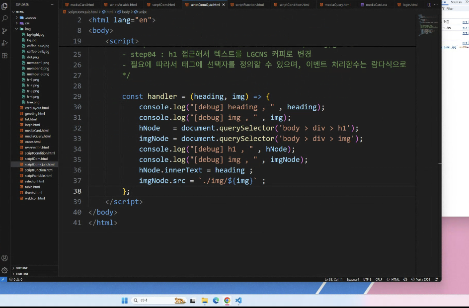
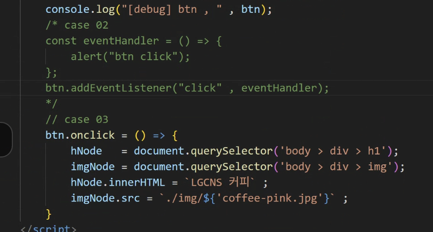

# 0729 DAY 6

## 함수

1. Function 키워드 함수선언
2. 익명 함수
3. 화살표함수 (Lambda expression)

```
function 함수명(인수,...){
  //함수 로직

  return 반환값;
}
```



textContent // innerText
=>

특정영역에 text 삽입 시 : innerText, textContent, innerHTML

textContent가 DOM구조여서 innerText보다 빠름
innerHTML이 가장 쓰기 좋다 !



---

## DOM

### 요소 노드 취득

#### ID 값으로

`document.getElementById('id');`
`document.querySelector(”#id”); `

#### 태그명으로

`document.getElementByTagName('name')`

#### 셀렉터 식에 일치하는 요소 취득\

`document.querySelector('selector')`

`document.querySelectorAll('selector')`

### 자식 요소 리스트 취득

- firstChild/nextSibling
- firstElementChild/nextElementSibling
- lastElementChild/previousElementSibling
