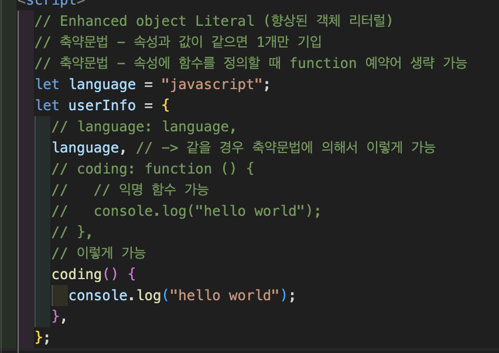
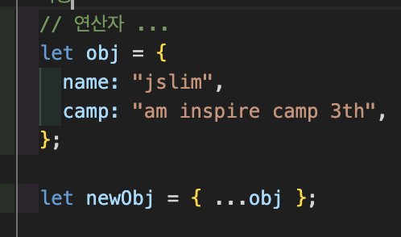
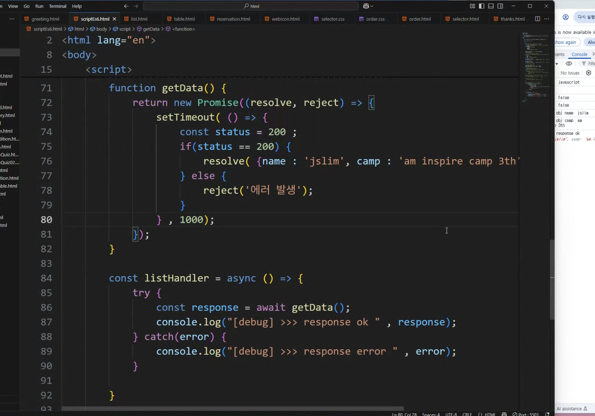

# DAY 7 (07.30)

## ES6

### Enhanced object Literal (향상된 객체 리터럴)

### 축약문법

1. 속성과 값이 같으면 1개만 기입
2. 속성에 함수를 정의할 때 function 예약어 생략 가능

### Spread Operator :

특정 객체 또는 배열의 값을 다른객체, 다른 배열로 복제하거나 옮길 때 사용

---

## 비동기 데이터 처리방식

https://axios-http.com/kr/docs/intro

### Promise (resolve, reject)

비동기 작업의 처리를 도와주는 객체

### 통신을 위한 함수 또는 라이브러리 : fetch(), axios

## modules

### JSX

브라우저에 따라서 안될 수도 있음
모듈번들러? 웹팩? 같은걸 보통 깔아줘야함.. -> 근데 리액트 설치할때 알아서 됨 ㅎ

https://jsonplaceholder.typicode.com/users
